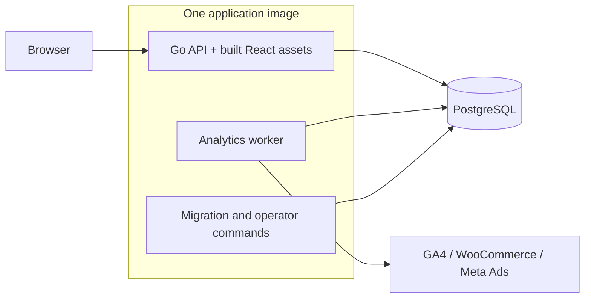

# Roisey Else

> One workspace for client operations, finance, and measured performance.

[](https://github.com/theroisey/else/actions/workflows/ci.yml)


[](https://github.com/theroisey/else/pkgs/container/else)

Roisey Else is a centralized operations platform for teams managing multiple client accounts. It brings client records, tasks, plans, reminders, collections, pricing, and provider reports into dedicated client workspaces, with permissions and traceable history throughout.

**[Quick start](#quick-start)** · **[Features](#features)** · **[Architecture](#architecture)** · **[Development](#local-development)** · **[Production](#production-deployment)** · **[Documentation](#documentation)**

## Overview

Each client has an operational home: what needs attention, what is due next, the financial position by currency, and recent authorized activity. Dedicated modules hold the detailed work and reports. Users see the modules their current permissions allow; the backend enforces access to every client and record.

The application is a modular Go service with a React interface and PostgreSQL storage. Production uses **one application image** for the web service, background worker, and operator commands. Development uses **one branch: `main`**.

## Features

| Area | Implemented capabilities |
| --- | --- |
| **Clients** | Searchable, paginated directory; legal/display names, contacts, website, tags, notes, and confirmed archival with retained history. |
| **Client overview** | One aggregate read for overdue and upcoming work, exact collection totals by currency, and safe recent activity; inaccessible modules are omitted. |
| **Operations** | Assigned tasks with priorities, dates, tags, and state transitions; plans and milestones with historical task links; timezone-aware reminders with completion and dismissal. |
| **Finance** | Collections, partial payments, payment history, outstanding/overdue totals, and retained cancellation records. |
| **Pricing** | Versioned service agreements, exact quantity/discount/tax calculations, restricted internal costs, and immutable terms copied into collections. |
| **Provider reports** | GA4 web analytics, WooCommerce commerce reports, and Meta Ads marketing reports with manual credential setup and background synchronization. |
| **Access** | Cookie-session authentication; user and role administration; configurable permission sets with global or exact-client assignments. |
| **History** | Audited business and access changes, a filtered audit reader, and a separate permission-aware activity timeline. |
| **Releases** | Read-only Release Center showing the running API's build version, source revision, and build time when stamped. |

### Client workspace

```text
Client
├── Overview
├── Profile
├── Tasks
├── Planning
├── Reminders
├── Finance
├── Pricing
├── Marketing          Meta Ads
├── Commerce           WooCommerce
├── Web analytics      GA4
├── Integrations
├── Activity
└── Audit history
```

Client routes live under `/app/clients/:id`. Users, roles, personal access, global audit history, and the Release Center are available through the main workspace. Navigation follows current grants; archival preserves authorized reads while preventing new client work.

### Preview

Existing browser-verification captures use **clearly labelled synthetic data**, rather than customer records or live provider observations.


<details>
<summary>More workspace previews</summary>

- [Client overview](docs/screenshots/overview-desktop.png)
- [Finance and collections](docs/screenshots/finance-desktop.png)
- [GA4 web analytics](docs/screenshots/ga4-workspace-desktop.png)
- [WooCommerce commerce](docs/screenshots/woocommerce-workspace-desktop.png)
- [Meta Ads on mobile](docs/screenshots/meta-workspace-mobile.png)

</details>

## Architecture



The web service serves React assets and `/api/v1` from one origin. Domain services separate transport, authorization, business rules, database access, and audit writing. PostgreSQL holds shared sessions, permissions, business records, encrypted credentials, synchronization jobs, and report snapshots.

Provider requests run in an independent `/analytics-worker` process from the **same image**. Web requests enqueue work and return without waiting for vendors. Workers use durable leases, bounded collection, and generation checks; GA4, WooCommerce, and Meta share a limit of two live synchronization jobs across replicas.

The root multi-stage Dockerfile builds the frontend and Go executables into a nonroot `scratch` runtime. Node and npm are build tools. PostgreSQL is separate infrastructure. Web replicas share database state and do not require sticky sessions.

### Technology stack

| Layer | Technology |
| --- | --- |
| Interface | React 19, TypeScript, Tailwind CSS, Font Awesome |
| Frontend tooling | Vite, npm, React Router, TanStack Query, React Hook Form, Zod |
| Backend | Go 1.27.1, standard-library HTTP, pgx |
| Database and migrations | PostgreSQL 18.3, embedded SQL migrations with Goose |
| Verification | Vitest, Testing Library, Playwright, Go race tests, real PostgreSQL and container integration |
| Delivery | Docker BuildKit, Docker Compose, GitHub Actions, GitHub Container Registry |

### Repository structure

```text
.
├── frontend/
│   ├── src/app/              Routing, query configuration, styles
│   ├── src/features/         Client and administration modules
│   ├── src/components/ui/    Shared interface primitives
│   ├── src/services/         HTTP and authenticated transport
│   ├── e2e/                 Browser flows and synthetic fixtures
│   └── scripts/             Browser and security verification
├── backend/
│   ├── cmd/                 API, worker, healthcheck, operator entrypoints
│   ├── internal/            Domain services and infrastructure
│   ├── migrations/          Embedded, versioned SQL
│   └── scripts/             Build, database, container, publication checks
├── docker/                  Local TLS preparation and PostgreSQL setup
├── .github/workflows/       CI and tested-image publication
├── docs/                    Domain contracts and operating guides
├── notes/                   Obsidian project knowledge and decisions
├── Dockerfile               The single application image
├── docker-compose.yml       Local application and database
├── .env.example             Local Compose variable reference
└── AGENTS.md                Engineering and contribution contract
```

## Quick start

### Requirements

For Docker startup, install Git, Docker Engine with BuildKit, **Docker Compose 2.24.4 or newer**, and OpenSSL. Use a POSIX shell and an interactive terminal for initial administrator creation. Docker builds the pinned Node and Go toolchains; host installations are needed only for source development and tests.

### Start a fresh local installation

```sh
git clone git@github.com:theroisey/else.git
cd else

sh docker/dev/prepare.sh
docker compose build backend
docker compose up -d --wait postgres
docker compose run --rm migrate up
docker compose exec -T postgres psql -U postgres -d else < backend/scripts/grant-runtime.sql
docker compose up -d --wait
```

The preparation script generates three distinct random database passwords in ignored `.env`, plus local CA-signed PostgreSQL TLS material. It refuses to overwrite existing `.env` or TLS files. `.env.example` documents the settings; its password markers are not usable credentials.

Migrations and grants are explicit setup steps. The API does not migrate on startup. The Compose service named `backend` serves the **entire application**, including the frontend.

### Create the first administrator

Run once, after migrations and grants:

```sh
BOOTSTRAP_ADMIN_EMAIL=owner@example.com \
BOOTSTRAP_ADMIN_NAME='Initial Administrator' \
docker compose run --rm bootstrap-admin
```

Use your own email and display name. Enter a password of 12–128 UTF-8 bytes at the interactive prompt; it is not echoed. Bootstrap requires an empty user table and assigns the ordinary **Initial Administrator** role. There is no default login or seeded demo password.

| Destination | Local URL |
| --- | --- |
| Application and login | [http://localhost:5173](http://localhost:5173) |
| API base | `http://localhost:5173/api/v1` |
| JSON service status | `http://localhost:5173/status` |
| Liveness / readiness | `http://localhost:5173/health` / `http://localhost:5173/ready` |

Local Compose publishes only the application's loopback port. PostgreSQL stays on its private container network. This startup supports core workspaces; provider setup also needs a protected keyring and a supervised worker, as described under [analytics and integrations](#analytics-and-integrations).

## Environment configuration

Keep local generated credentials with their database volume. Production settings belong in the hosting platform's secret/configuration management. Database URLs must contain explicit credentials, host, port, and database; non-loopback connections require `sslmode=verify-full` with a trusted CA.

| Variable | Used by | Requirement / default |
| --- | --- | --- |
| `POSTGRES_PASSWORD` | Local Compose database | Generated local administrative password. |
| `MIGRATOR_PASSWORD` | Local Compose tools | Generated migration-owner password. |
| `RUNTIME_PASSWORD` | Local Compose web service | Generated least-privileged runtime password. |
| `FRONTEND_PORT` | Local Compose | Optional; `5173`, bound to `127.0.0.1`. |
| `DATABASE_URL` | API and worker | Required private runtime connection URL; Compose supplies it. |
| `MIGRATION_DATABASE_URL` | Migration command | Required private migration-owner URL. |
| `BOOTSTRAP_DATABASE_URL` | Bootstrap command | Required private owner URL; never supplied to the API. |
| `BOOTSTRAP_ADMIN_EMAIL`, `BOOTSTRAP_ADMIN_NAME` | Bootstrap command | Required initial identity fields. Password is prompted separately. |
| `AUTH_PUBLIC_ORIGIN` | API | Required exact browser origin, without a path; Compose uses `http://localhost:5173` by default. |
| `AUTH_COOKIE_SECURE` | API | Defaults to `true`; `false` is accepted only for loopback HTTP development. |
| `HTTP_ADDRESS` | API | Defaults to `127.0.0.1:8080`; image sets `0.0.0.0:8080`. |
| `FRONTEND_DIRECTORY` | API | Optional absolute static-build path; image sets `/frontend`. |
| `LOG_LEVEL` | API | Optional `debug`, `info`, `warn`, or `error`; defaults to `info`. |
| `INTEGRATION_KEYRING_FILE` | API, worker, rotation command | Protected absolute Linux key-file path; required for credential setup and workers. |
| `INTEGRATION_KEYRING_MODE` | Key-dependent processes | Defaults to `normal`; `restored` is reserved for the documented recovery procedure. |

HTTP duration settings accept Go duration strings:

| Setting | Default |
| --- | --- |
| `HTTP_READ_HEADER_TIMEOUT` | `5s` |
| `HTTP_READ_TIMEOUT`, `HTTP_WRITE_TIMEOUT` | `15s` |
| `HTTP_REQUEST_TIMEOUT` | `5s` |
| `HTTP_IDLE_TIMEOUT` | `60s` |
| `HTTP_SHUTDOWN_TIMEOUT` | `10s` |
| `HTTP_READINESS_TIMEOUT` | `2s` |
| `HTTP_MAX_HEADER_BYTES` | `16384` bytes |

Startup validates settings and timeout relationships. See [HTTP configuration](docs/backend-http.md), [database configuration](docs/database.md), [runtime budgets](docs/runtime-budgets.md), and [protected key provisioning](docs/integration-key-startup.md). Build stamps are compiled into the binary; runtime environment values cannot replace them.

## Docker operation and database migrations

The Compose services are `postgres`, `backend`, and the tool-profile services `migrate` and `bootstrap-admin`. Both tools reuse `roisey-else:local`, the same application image as the web service.

| Action | Command from repository root |
| --- | --- |
| Start initialized stack | `docker compose up -d --wait` |
| Check containers | `docker compose ps` |
| Check configuration without exposing values | `docker compose config --quiet` |
| Follow application logs | `docker compose logs -f backend` |
| Check migration state | `docker compose run --rm migrate status` |
| Apply pending migrations | `docker compose run --rm migrate up` |
| Apply reviewed runtime grants after migrations | `docker compose exec -T postgres psql -U postgres -d else < backend/scripts/grant-runtime.sql` |
| Rebuild application | `docker compose build backend` |
| Recreate application after a build | `docker compose up -d --wait backend` |
| Stop services | `docker compose stop` |
| Remove containers, retain database volume | `docker compose down` |

PostgreSQL data persists in the `postgres-data` named volume. Removing that volume deletes local data. Keep existing passwords when restarting or recreating containers. Rendered Compose configuration and container environments contain secrets and must not be shared.

Migrations live in `backend/migrations/`, with six-digit filenames and Goose `Up`/`Down` sections embedded into `/migrate`. Apply new migrations through the owner identity, then review and reapply the narrow runtime grants. Applied migration files are immutable. `down` reverts one migration; populated-history guards can refuse destructive rollback. Use the [database guide](docs/database.md) for lifecycle rules and the [recovery guide](docs/recovery.md) for recovery decisions.

The `docker-compose.production.yml` overlay supports local artifact verification; production rollout requires environment-specific infrastructure. If a managed build environment provides `CODEX_PROXY_CERT`, the [Docker guide](docs/docker.md#managed-build-ca) explains the build-only CA overlay.

## Local development

Use **Node 24.21.0**, **npm 11.19.0**, and **Go 1.27.1**, matching the repository and CI pins. Source development runs Vite and the API separately.

Provision a development PostgreSQL database and separate migration/runtime roles using the [database guide](docs/database.md). Supply private `MIGRATION_DATABASE_URL` and `DATABASE_URL` through your local environment, apply migrations and runtime grants, and bootstrap an administrator if needed. The default Compose database is private and is not directly reachable by a host Go process.

In a backend terminal, with those URLs already supplied:

```sh
cd backend
go mod download
go run ./cmd/migrate up
AUTH_PUBLIC_ORIGIN=http://127.0.0.1:5173 \
AUTH_COOKIE_SECURE=false \
HTTP_ADDRESS=127.0.0.1:8080 \
go run ./cmd/api
```

In a frontend terminal:

```sh
cd frontend
npm ci
npm run dev
```

Open **http://127.0.0.1:5173**. Vite proxies `/api/v1/`, `/health`, and `/ready` to `127.0.0.1:8080`. Match the browser host exactly to `AUTH_PUBLIC_ORIGIN`: `localhost` and `127.0.0.1` are different origins. Stop the Compose web service before using Vite on the same port. Plain developer builds correctly show unavailable release metadata.

## Authentication, permissions, and history

Authentication uses Argon2id password hashing and revocable PostgreSQL-backed sessions. Session cookies are HttpOnly and SameSite=Strict, with Secure enabled for production. Unsafe authenticated requests require the configured Origin and a session-bound CSRF token. Passwords and session tokens are never returned as business data or stored in browser local storage.

Roles are configurable permission collections. The seeded roles are **Initial Administrator**, **Finance**, and **Viewer**; names do not determine authorization. Assignments can be global or restricted to a real client. Client assignments cannot grant global administration permissions, and delegated managers cannot grant authority they do not hold. New domain permissions require explicit role grants rather than automatic expansion of custom roles.

Every protected operation checks current account status, permissions, and resource scope on the server. UI visibility is a convenience. See [identity](docs/identity.md), [authorization](docs/authorization.md), and [administration](docs/administration.md).

Significant business and access mutations commit with their audit events in the same transaction. The **audit reader** provides authorized filtering and inspection of safe event details; normal application workflows cannot rewrite audit history. **Activity** is a separate, human-readable projection restricted by current client and domain permissions. See [audit history](docs/audit-reader.md) and [activity](docs/activity.md).

## Finance and operational workflows

Collections distinguish pending, partially paid, paid, overdue, and cancelled states. Payments retain their own history; cancellation preserves the obligation and recorded payments. Command reconciliation prevents an uncertain response from becoming a duplicate payment. Amounts use exact minor-unit strings with explicit **USD, EUR, GBP, TRY, JPY, or KWD** currencies; totals remain separated by currency.

Pricing supports recurring and one-time service lines, quantities, discounts, taxes, effective dates, and manager-only internal costs. New versions preserve prior terms. Copying a version into a collection retains an immutable financial snapshot. See [collections](docs/billing.md) and [pricing](docs/pricing.md).

Tasks support assignments, priorities, start/due dates, tags, and guarded status transitions. Plans and milestones group longer-term work and retain task-link history. Reminders store an explicit IANA timezone and resolve daylight-saving ambiguities before scheduling; owners can be assigned and reminders completed or dismissed under current permissions. Reminders are one-time records; recurring schedules and external notification delivery are not implemented. See [tasks](docs/tasks.md), [planning](docs/planning.md), and [reminders](docs/reminders.md).

## Analytics and integrations

Integration managers manually provision provider credentials through a client connection. Credentials are encrypted before storage and excluded from metadata responses, logs, and audit snapshots. Setup requires protected server key material; synchronization requires a separately supervised `/analytics-worker` using the same application image and runtime database identity. Default local Compose does not launch a worker or provision integration keys.

| Provider | Setup | Stored reports |
| --- | --- | --- |
| **Google Analytics 4** | Read-only service-account JSON key with access to the selected property | Period summary, daily activity, acquisition, devices, and landing pages; property-local periods up to 31 inclusive days. |
| **WooCommerce** | Read-only REST API consumer key/secret for an immutable HTTPS shop origin | Order-created cohorts, refund-event cohorts, daily commerce measures, and product performance; explicit currency and UTC intervals up to 31 days. |
| **Meta Ads** | Compatible manually issued user token with `ads_read` for the selected ad account | Daily and period spend, impressions, clicks, and exact weighted CTR/CPC/CPM; account-local periods up to 31 inclusive days. |

Reading reports never starts synchronization or contacts a provider. Queued, running, failed, stale, empty, and never-synchronized states are explicit; a failed refresh can retain a prior successful snapshot. Reports retain provider currency/calendar semantics. WooCommerce cohorts do not claim realized cash revenue; Meta reports do not infer attribution, revenue, or ROAS.

There is no in-app OAuth issuance or automatic token refresh. Local disconnect fences application work; remote credential revocation remains a manual provider-account action.

Use the provider guides for account requirements, worker configuration, restrictions, and validation: [GA4](docs/ga4-synchronization.md), [WooCommerce](docs/woocommerce-synchronization.md), [Meta Ads](docs/meta-synchronization.md), and [integration security](docs/integrations.md).

## API and health checks

Business endpoints use **`/api/v1`**, cookie-session authentication, permission checks, and safe JSON data/error envelopes with request correlation. Unsafe authenticated calls also require Origin, JSON content type, and `X-CSRF-Token`. Consult the domain guides for exact request bodies, revisions, pagination, and retry rules.

| Endpoint | Purpose |
| --- | --- |
| `GET /health` | Process liveness. |
| `GET /ready` | Bounded PostgreSQL connectivity; returns 503 during database outage or drain. |
| `GET /api/v1/auth/session` | Current authenticated identity and effective grants. |
| `GET /api/v1/releases` | Running build metadata; requires global `releases.view`. |

```sh
curl --fail http://localhost:5173/health
curl --fail http://localhost:5173/ready
```

Readiness is a connectivity check, not proof of schema compatibility, provider access, or recoverability. See [HTTP behavior](docs/backend-http.md) and [browser security](docs/browser-security.md).

## Testing

Run frontend validation from `frontend/`:

```sh
npm ci
npm run lint
npm run typecheck
npm test
npm run build
```

Run backend checks from `backend/`:

```sh
gofmt -l .
go vet ./...
go test -race -count=1 ./...
```

`gofmt -l` should produce no filenames. Full verification includes disposable databases and actual production artifacts. From the repository root:

```sh
sh backend/scripts/test-integration.sh
sh backend/scripts/test-compose.sh
```

For actual Go-served React browser flows, first install frontend dependencies and Playwright Chromium, then run the isolated runner:

```sh
(cd frontend && npm ci && npx playwright install --with-deps chromium)
sh frontend/scripts/test-auth-browser.sh
```

Database/container verification requires Git, Docker with Compose/BuildKit, OpenSSL, Go, Python 3, curl, and standard POSIX utilities. Browser checks additionally require Node/npm, Playwright Chromium, and the local Docker Unix socket. The browser runner refuses an occupied port `5173`. Container verification tests **committed `HEAD`** through `git archive`, so uncommitted application edits are excluded. Database recovery tests need Git history for the pinned prior source; use a full clone. Runners create and clean their own disposable resources and must not be pointed at customer databases.

## CI, versions, and releases

[GitHub Actions](.github/workflows/ci.yml) runs six required gates before image publication:

| Gate | Coverage |
| --- | --- |
| Frontend checks | Lint, types, unit/component tests, production build. |
| Browser authentication | Real API/PostgreSQL browser flows and compiled frontend security checks. |
| Backend checks | Formatting, vet, race tests, static builds, workflow and operator-script boundaries. |
| Dependency security | Complete npm dependency audit and Go vulnerability checks, including integration-tagged source. |
| PostgreSQL integration | Migrations, permissions, domain transactions, provider lifecycles, capacity, and recovery rehearsals. |
| Container integration | Single-image startup, TLS, role isolation, migrations, persistence, outage recovery, headers, release stamps, and key/operator boundaries. |

Successful `main` push or manual workflow runs publish **`ghcr.io/theroisey/else`** by promoting the exact image archive tested by container CI. Publication checks revision evidence and does not rebuild the application. CI also supports PR validation against `main`; PR events do not publish.

Image tags include `sha-` plus the full commit SHA and a guarded `latest` alias. Manual workflow input can add a stable `vMAJOR.MINOR.PATCH` alias. Running build identifiers remain `sha-<full-commit>`; an image alias does not establish a deployed or approved release. Pin a verified image digest for production.

The Release Center shows the running API stamp when available. Latest release, registry provenance, and deployment observations are separately unavailable; it has no rollout or update controls. See [CI](docs/ci.md), [release semantics](docs/releases.md), and [Release Center](docs/release-interface.md).

## Production deployment

The reference deployment uses a **managed OCI container host and managed PostgreSQL**, with React and the API behind one HTTPS origin. Hosting account, region, domain, secrets, and rollout are operator-specific. A standard static/Node-only Vercel deployment cannot run the long-lived Go service and worker unchanged.

Follow the [production operating runbook](docs/production-readiness.md) before releasing traffic:

- Select a verified `main` revision and immutable application digest. Use that same digest for web, worker, and temporary operator processes.
- Provision separate database owner/runtime identities, verified private TLS, reviewed migrations, and narrow grants. Keep owner credentials out of web and worker processes.
- Configure the exact HTTPS `AUTH_PUBLIC_ORIGIN`, secure cookies, protected key mounts, and supervised workers. Run nonroot with a read-only filesystem and dropped capabilities.
- Budget connection pools across replicas and rolling replacements: web pools allow 10 connections per process, workers 2, migrations 1. Add headroom for backup and operations.
- Configure readiness routing, graceful shutdown, edge login throttling, safe log collection, actionable monitoring, and named operational ownership.
- Verify target-specific CRUD, access denials, provider egress, backup restore, and artifact/schema compatibility before an explicitly approved rollout.

Capacity checks use synthetic data representing 500 clients and 100 concurrent sessions with common-route P95 screening under two seconds, including multiple API/worker instances. These are local/CI rehearsals; deployed latency, sustained vendor traffic, and recovery objectives require measurements on the chosen host. See [capacity readiness](docs/capacity-readiness.md).

### Backup and recovery

Back up PostgreSQL to protected durable storage, select retention/PITR with the database operator, and rehearse restoration into an isolated database. Preserve migration history, grants, financial/audit records, and keys required by both live ciphertext and retained backups.

A restore can rewind encryption accounting. Stop all writers, provision a never-used active key while retaining required decryption keys, and follow the declared-restore procedure. Artifact rollback must be compatible with the restored schema and all three provider contracts. See [recovery](docs/recovery.md) and [key startup and restores](docs/integration-key-startup.md).

### Security

Keep `.env`, database passwords, key files, provider tokens, and backup archives outside Git and frontend assets. Use production secret management and approved read-only mounts. Server authorization, strict browser security headers, bounded requests/queries, encrypted provider credentials, and atomic audits protect the application boundary; edge protection and host/database operations remain deployment responsibilities. See the [security review](docs/security-review.md).

## Troubleshooting

| Symptom | Check / action |
| --- | --- |
| Preparation refuses existing files | Preserve `.env` and TLS material with their existing database volume. Follow certificate renewal guidance in [Docker operations](docs/docker.md). |
| Application port is occupied | Choose another `FRONTEND_PORT` in local `.env` and recreate `backend`; use the matching `localhost` URL. Vite/browser tests separately require `5173` to be free. |
| `/ready` returns 503 | Check `docker compose ps`, database health, verified TLS, and private connection settings. Liveness can remain healthy during an outage. |
| A business route fails after startup | Check migration status and apply the reviewed runtime grants; readiness alone does not validate schema or privileges. |
| Login or a write is rejected | Use the exact configured browser origin and current session. For source development, verify Vite's API proxy and CSRF transport. |
| No initial login exists | Run interactive bootstrap after migration/grants; existing installations require an authorized administrator. |
| Provider setup refuses or jobs remain queued | Check protected key configuration, worker startup, current management grants, provider access, and permitted HTTPS egress. Refresh connection state before retrying an uncertain write. |
| UI still reflects an earlier build | Rebuild `backend` and recreate its container. Docker serves compiled assets; source hot reload is provided by Vite. |

## Contributing

Read [AGENTS.md](AGENTS.md) and the relevant domain guides first. GitHub Issues are the planning source of truth; use the existing issue for scoped follow-up work. Implement in the appropriate source directory on **`main` only**, preserve in-progress changes, and do not create frontend, backend, or review branches.

Make small conventional commits, update the affected documentation, and run the checks appropriate to the change before pushing. All six CI gates and tested-image publication remain required. A push or successful build does not authorize production deployment.

## Documentation

| Topic | Guides |
| --- | --- |
| Architecture and setup | [Architecture](docs/architecture.md) · [Docker](docs/docker.md) · [Database](docs/database.md) · [HTTP](docs/backend-http.md) |
| Identity and access | [Authentication](docs/identity.md) · [Authorization](docs/authorization.md) · [Administration](docs/administration.md) |
| Clients and operations | [Clients](docs/clients.md) · [Overview](docs/client-overview.md) · [Tasks](docs/tasks.md) · [Planning](docs/planning.md) · [Reminders](docs/reminders.md) |
| Finance | [Collections](docs/billing.md) · [Pricing](docs/pricing.md) |
| Providers | [Integration boundaries](docs/integrations.md) · [GA4](docs/ga4-synchronization.md) · [WooCommerce](docs/woocommerce-synchronization.md) · [Meta](docs/meta-synchronization.md) |
| History and releases | [Audit reader](docs/audit-reader.md) · [Activity](docs/activity.md) · [Releases](docs/releases.md) · [CI](docs/ci.md) |
| Production operations | [Runbook](docs/production-readiness.md) · [Capacity](docs/capacity-readiness.md) · [Runtime budgets](docs/runtime-budgets.md) · [Recovery](docs/recovery.md) |
| Keys and security | [Key startup](docs/integration-key-startup.md) · [Rotation command](docs/integration-rotation-command.md) · [Key inventory](docs/integration-key-inventory.md) · [Browser security](docs/browser-security.md) · [Security review](docs/security-review.md) |

## License

No public license has been declared. The repository does not contain a license file.
