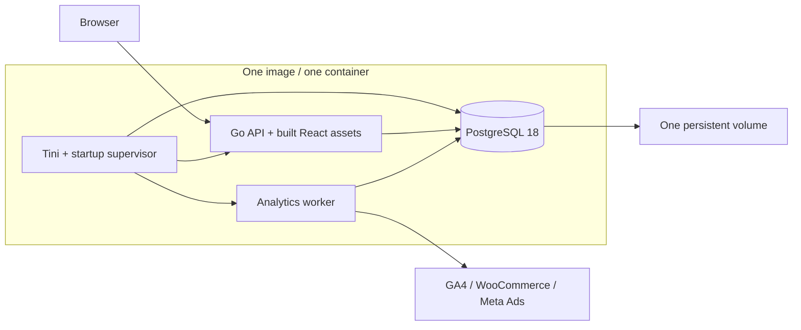

# Roisey Else

> One workspace for client operations, finance, and measured performance.

[](https://github.com/theroisey/else/actions/workflows/ci.yml)


[](https://github.com/theroisey/else/pkgs/container/else)

Roisey Else is a centralized operations platform for teams managing multiple client accounts. It brings client records, tasks, plans, reminders, collections, pricing, and provider reports into dedicated client workspaces, with permissions and traceable history throughout.

**[Quick start](#quick-start)** · **[Features](#features)** · **[Architecture](#architecture)** · **[Development](#local-development)** · **[Production](#production-deployment)** · **[Documentation](#documentation)**

## Overview

Each client has an operational home: what needs attention, what is due next, the financial position by currency, and recent authorized activity. Dedicated modules hold the detailed work and reports. Users see the modules their current permissions allow; the backend enforces access to every client and record.

The application is a modular Go service with a React interface and PostgreSQL storage. Production uses **one Docker image and one container** for PostgreSQL, the web service, background worker, and operator commands. Development uses **one branch: `main`**.

## Features

| Area | Implemented capabilities |
| --- | --- |
| **Clients** | Searchable, paginated directory; legal/display names, contacts, website, tags, notes, and confirmed archival with retained history. |
| **Client overview** | One aggregate read for overdue and upcoming work, exact collection totals by currency, and safe recent activity; inaccessible modules are omitted. |
| **Operations** | Assigned tasks with priorities, dates, tags, and state transitions; plans and milestones with historical task links; timezone-aware reminders with completion and dismissal. |
| **Finance** | Collections, partial payments, payment history, outstanding/overdue totals, and retained cancellation records. |
| **Pricing** | Versioned service agreements, exact quantity/discount/tax calculations, restricted internal costs, and immutable terms copied into collections. |
| **Provider reports** | GA4 web analytics, WooCommerce commerce reports, and Meta Ads marketing reports with manual credential setup and background synchronization. |
| **Access** | Cookie-session authentication; user and role administration; configurable permission sets with global or exact-client assignments. |
| **History** | Audited business and access changes, a filtered audit reader, and a separate permission-aware activity timeline. |
| **Releases** | Read-only Release Center showing the running API's build version, source revision, and build time when stamped. |

### Client workspace

```text
Client
├── Overview
├── Profile
├── Tasks
├── Planning
├── Reminders
├── Finance
├── Pricing
├── Marketing          Meta Ads
├── Commerce           WooCommerce
├── Web analytics      GA4
├── Integrations
├── Activity
└── Audit history
```

Client routes live under `/app/clients/:id`. Users, roles, personal access, global audit history, and the Release Center are available through the main workspace. Navigation follows current grants; archival preserves authorized reads while preventing new client work.

### Preview

Existing browser-verification captures use **clearly labelled synthetic data**, rather than customer records or live provider observations.


<details>
<summary>More workspace previews</summary>

- [Client overview](docs/screenshots/overview-desktop.png)
- [Finance and collections](docs/screenshots/finance-desktop.png)
- [GA4 web analytics](docs/screenshots/ga4-workspace-desktop.png)
- [WooCommerce commerce](docs/screenshots/woocommerce-workspace-desktop.png)
- [Meta Ads on mobile](docs/screenshots/meta-workspace-mobile.png)

</details>

## Architecture



Go serves React assets and `/api/v1` from one origin on port 8080. PostgreSQL runs privately on container loopback; its port is never published. The startup supervisor initializes an empty cluster, applies pending embedded migrations, restores reviewed runtime grants, and starts the API and worker only after those steps succeed. Restarting preserves existing records and migration history.

Provider requests run in the supervised `/analytics-worker` process. Web requests enqueue durable jobs and return without waiting for vendors. Domain services preserve authorization, financial precision, transaction boundaries, and audit writing.

The multi-stage build uses Node/npm and Go only during compilation. The final image includes PostgreSQL, compiled React assets, Go executables, and Tini; it has no Node, npm, or Nginx. PostgreSQL runs as UID 999, API/worker as UID 65532, and migration/bootstrap commands as UID 65533. The root supervisor has only the capabilities needed for initialization, identity changes, and shutdown. The API receives only its restricted runtime database identity.

### Technology stack

| Layer | Technology |
| --- | --- |
| Interface | React 19, TypeScript, Tailwind CSS, Font Awesome |
| Frontend tooling | Vite, npm, React Router, TanStack Query, React Hook Form, Zod |
| Backend | Go 1.27.1, standard-library HTTP, pgx |
| Database and migrations | PostgreSQL 18.3, embedded SQL migrations with Goose |
| Verification | Vitest, Testing Library, Playwright, Go race tests, real PostgreSQL and container integration |
| Delivery | Docker BuildKit, Docker Compose, GitHub Actions, GitHub Container Registry |

### Repository structure

```text
.
├── frontend/
│   ├── src/app/              Routing, query configuration, styles
│   ├── src/features/         Client and administration modules
│   ├── src/components/ui/    Shared interface primitives
│   ├── src/services/         HTTP and authenticated transport
│   ├── e2e/                 Browser flows and synthetic fixtures
│   └── scripts/             Browser and security verification
├── backend/
│   ├── cmd/                 API, worker, healthcheck, operator entrypoints
│   ├── internal/            Domain services and infrastructure
│   ├── migrations/          Embedded, versioned SQL
│   └── scripts/             Build, database, container, publication checks
├── docker/                  Container initialization, supervision, and operator tools
├── .github/workflows/       CI and tested-image publication
├── docs/                    Domain contracts and operating guides
├── notes/                   Obsidian project knowledge and decisions
├── Dockerfile               The single complete application image
├── docker-compose.yml       One service, one port, one persistent volume
├── .env.example             Local Compose variable reference
└── AGENTS.md                Engineering and contribution contract
```

## Quick start

### Requirements

Install Git, Docker Engine, and Docker Compose 2.24.4 or newer. Host Node, Go, PostgreSQL, and OpenSSL are unnecessary for the published installation. Initial administrator creation needs an interactive terminal.

### Start a fresh installation

```sh
git clone git@github.com:theroisey/else.git
cd else
cp .env.example .env
docker compose up -d
```

Open **[http://localhost:8080](http://localhost:8080)** once `docker compose ps` reports healthy. The single `else` service pulls `ghcr.io/theroisey/else:latest` (the package must be Public for login-free pulls); PostgreSQL initialization, migrations, runtime grants, private credential/key provisioning, and worker startup happen automatically. There are no manual database setup commands.

### Create the first administrator

```sh
docker compose exec -it else /opt/else/operator bootstrap-admin owner@example.com 'Initial Administrator'
```

Use your own email and name. Enter a 12–128-byte password at the hidden prompt. Bootstrap requires an empty user table and assigns the ordinary **Initial Administrator** role. There is no default password.

| Destination | Local URL |
| --- | --- |
| Application and login | [http://localhost:8080](http://localhost:8080) |
| API base | `http://localhost:8080/api/v1` |
| JSON status | `http://localhost:8080/status` |
| Liveness / readiness | `http://localhost:8080/health` / `http://localhost:8080/ready` |

## Environment configuration

The minimal `.env` contains:

| Variable | Default / purpose |
| --- | --- |
| `APP_PORT` | `8080`; host loopback application port. |
| `AUTH_PUBLIC_ORIGIN` | `http://localhost:8080`; exact browser origin. Match any port change. |
| `AUTH_COOKIE_SECURE` | `false` for loopback HTTP; set `true` with an HTTPS production origin. |
| `ELSE_IMAGE` | Optional image reference; defaults to `ghcr.io/theroisey/else:latest`. Pin a verified digest for production. |
| `ELSE_DATA_VOLUME` | Optional existing volume selector; defaults to `roisey-else_postgres-data`. |

Database passwords and integration encryption keys are generated privately and retained in the same persistent volume as PostgreSQL. They are not required in `.env`. Never publish this volume, private key files, backups, or process environments. Advanced standalone API settings are documented in [HTTP configuration](docs/backend-http.md), [database configuration](docs/database.md), and [runtime budgets](docs/runtime-budgets.md).

## Docker operation and database migrations

| Action | Command |
| --- | --- |
| Start / wait for readiness | `docker compose up -d --wait` |
| Inspect status | `docker compose ps` |
| Validate configuration | `docker compose config --quiet` |
| Follow logs | `docker compose logs -f else` |
| Restart | `docker compose restart else` |
| Inspect migration state | `docker compose exec -T else /opt/else/operator migrate status` |
| Upgrade published image | `docker compose pull && docker compose up -d --wait` |
| Stop gracefully | `docker compose stop` |
| Remove container, retain data | `docker compose down` |

The `else_data` volume mounts at `/var/lib/roisey-else`; the PostgreSQL cluster uses `18/docker`, and `.control` holds private durable credentials and encryption keys. Restarts, recreation, image upgrades, and ordinary `down` preserve it. **`docker compose down --volumes` permanently deletes application data and keys.** Use it only for a deliberately disposable reset.

Pending Goose migrations run automatically before the API starts; applied migrations remain immutable. The API itself never performs DDL or receives owner credentials. A failed migration or required process failure stops the entire container. Tini reaps children; graceful stop drains API/worker before stopping PostgreSQL. A filesystem lock prevents two containers from sharing the same cluster.

For an existing installation, back up the database and retained keys, stop the old stack, and select its actual PostgreSQL 18 volume before starting this distribution. The default physical volume name preserves the former root Compose default. Custom project names need `ELSE_DATA_VOLUME` set explicitly. Follow [upgrade and adoption](docs/docker.md#existing-installation-adoption); never point this image at a different-major cluster.

Local source builds use `docker build -t roisey-else:local .`, then `ELSE_IMAGE=roisey-else:local docker compose up -d --wait`. See [Docker operations](docs/docker.md), including managed-build CA support.

## Local development

Use **Node 24.21.0**, **npm 11.19.0**, and **Go 1.27.1**, matching the repository and CI pins. Source development runs Vite and the API separately.

Provision a development PostgreSQL database and separate migration/runtime roles using the [database guide](docs/database.md). Supply private `MIGRATION_DATABASE_URL` and `DATABASE_URL` through your local environment, apply migrations and runtime grants, and bootstrap an administrator if needed. The bundled PostgreSQL is private; standalone development uses a separate disposable development database.

In a backend terminal, with those URLs already supplied:

```sh
cd backend
go mod download
go run ./cmd/migrate up
AUTH_PUBLIC_ORIGIN=http://127.0.0.1:5173 \
AUTH_COOKIE_SECURE=false \
HTTP_ADDRESS=127.0.0.1:8080 \
go run ./cmd/api
```

In a frontend terminal:

```sh
cd frontend
npm ci
npm run dev
```

Open **http://127.0.0.1:5173**. Vite proxies `/api/v1/`, `/health`, and `/ready` to `127.0.0.1:8080`. Match the browser host exactly to `AUTH_PUBLIC_ORIGIN`: `localhost` and `127.0.0.1` are different origins. The default Compose port is 8080; stop it before starting a standalone API on that port. Plain developer builds correctly show unavailable release metadata.

## Authentication, permissions, and history

Authentication uses Argon2id password hashing and revocable PostgreSQL-backed sessions. Session cookies are HttpOnly and SameSite=Strict, with Secure enabled for production. Unsafe authenticated requests require the configured Origin and a session-bound CSRF token. Passwords and session tokens are never returned as business data or stored in browser local storage.

Roles are configurable permission collections. The seeded roles are **Initial Administrator**, **Finance**, and **Viewer**; names do not determine authorization. Assignments can be global or restricted to a real client. Client assignments cannot grant global administration permissions, and delegated managers cannot grant authority they do not hold. New domain permissions require explicit role grants rather than automatic expansion of custom roles.

Every protected operation checks current account status, permissions, and resource scope on the server. UI visibility is a convenience. See [identity](docs/identity.md), [authorization](docs/authorization.md), and [administration](docs/administration.md).

Significant business and access mutations commit with their audit events in the same transaction. The **audit reader** provides authorized filtering and inspection of safe event details; normal application workflows cannot rewrite audit history. **Activity** is a separate, human-readable projection restricted by current client and domain permissions. See [audit history](docs/audit-reader.md) and [activity](docs/activity.md).

## Finance and operational workflows

Collections distinguish pending, partially paid, paid, overdue, and cancelled states. Payments retain their own history; cancellation preserves the obligation and recorded payments. Command reconciliation prevents an uncertain response from becoming a duplicate payment. Amounts use exact minor-unit strings with explicit **USD, EUR, GBP, TRY, JPY, or KWD** currencies; totals remain separated by currency.

Pricing supports recurring and one-time service lines, quantities, discounts, taxes, effective dates, and manager-only internal costs. New versions preserve prior terms. Copying a version into a collection retains an immutable financial snapshot. See [collections](docs/billing.md) and [pricing](docs/pricing.md).

Tasks support assignments, priorities, start/due dates, tags, and guarded status transitions. Plans and milestones group longer-term work and retain task-link history. Reminders store an explicit IANA timezone and resolve daylight-saving ambiguities before scheduling; owners can be assigned and reminders completed or dismissed under current permissions. Reminders are one-time records; recurring schedules and external notification delivery are not implemented. See [tasks](docs/tasks.md), [planning](docs/planning.md), and [reminders](docs/reminders.md).

## Analytics and integrations

Integration managers manually provision provider credentials through a client connection. Credentials are encrypted before storage and excluded from metadata responses, logs, and audit snapshots. The container provisions a protected persistent server keyring and starts the supervised `/analytics-worker` automatically. Provider credentials and account access still require an authorized integration manager. For custom keys and rotation, follow the operator guides; retain decryption keys for all live ciphertext and backups.

| Provider | Setup | Stored reports |
| --- | --- | --- |
| **Google Analytics 4** | Read-only service-account JSON key with access to the selected property | Period summary, daily activity, acquisition, devices, and landing pages; property-local periods up to 31 inclusive days. |
| **WooCommerce** | Read-only REST API consumer key/secret for an immutable HTTPS shop origin | Order-created cohorts, refund-event cohorts, daily commerce measures, and product performance; explicit currency and UTC intervals up to 31 days. |
| **Meta Ads** | Compatible manually issued user token with `ads_read` for the selected ad account | Daily and period spend, impressions, clicks, and exact weighted CTR/CPC/CPM; account-local periods up to 31 inclusive days. |

Reading reports never starts synchronization or contacts a provider. Queued, running, failed, stale, empty, and never-synchronized states are explicit; a failed refresh can retain a prior successful snapshot. Reports retain provider currency/calendar semantics. WooCommerce cohorts do not claim realized cash revenue; Meta reports do not infer attribution, revenue, or ROAS.

There is no in-app OAuth issuance or automatic token refresh. Local disconnect fences application work; remote credential revocation remains a manual provider-account action.

Use the provider guides for account requirements, worker configuration, restrictions, and validation: [GA4](docs/ga4-synchronization.md), [WooCommerce](docs/woocommerce-synchronization.md), [Meta Ads](docs/meta-synchronization.md), and [integration security](docs/integrations.md).

## API and health checks

Business endpoints use **`/api/v1`**, cookie-session authentication, permission checks, and safe JSON data/error envelopes with request correlation. Unsafe authenticated calls also require Origin, JSON content type, and `X-CSRF-Token`. Consult the domain guides for exact request bodies, revisions, pagination, and retry rules.

| Endpoint | Purpose |
| --- | --- |
| `GET /health` | Process liveness. |
| `GET /ready` | Bounded PostgreSQL connectivity; returns 503 during database outage or drain. |
| `GET /api/v1/auth/session` | Current authenticated identity and effective grants. |
| `GET /api/v1/releases` | Running build metadata; requires global `releases.view`. |

```sh
curl --fail http://localhost:8080/health
curl --fail http://localhost:8080/ready
```

Readiness is a connectivity check, not proof of schema compatibility, provider access, or recoverability. See [HTTP behavior](docs/backend-http.md) and [browser security](docs/browser-security.md).

## Testing

Run frontend validation from `frontend/`:

```sh
npm ci
npm run lint
npm run typecheck
npm test
npm run build
```

Run backend checks from `backend/`:

```sh
gofmt -l .
go vet ./...
go test -race -count=1 ./...
```

`gofmt -l` should produce no filenames. Full verification includes disposable databases and actual production artifacts. From the repository root:

```sh
sh backend/scripts/test-integration.sh
sh backend/scripts/test-compose.sh
```

For actual Go-served React browser flows, first install frontend dependencies and Playwright Chromium, then run the isolated runner:

```sh
(cd frontend && npm ci && npx playwright install --with-deps chromium)
sh frontend/scripts/test-auth-browser.sh
```

Database/container verification requires Git, Docker with Compose/BuildKit, OpenSSL, Go, Python 3, curl, and standard POSIX utilities. Browser checks additionally require Node/npm, Playwright Chromium, and the local Docker Unix socket. The browser runner refuses an occupied port `5173`. Container verification tests **committed `HEAD`** through `git archive`, so uncommitted application edits are excluded. Database recovery tests need Git history for the pinned prior source; use a full clone. Runners create and clean their own disposable resources and must not be pointed at customer databases.

## CI, versions, and releases

[GitHub Actions](.github/workflows/ci.yml) runs six required gates before image publication:

| Gate | Coverage |
| --- | --- |
| Frontend checks | Lint, types, unit/component tests, production build. |
| Browser authentication | Real API/PostgreSQL browser flows and compiled frontend security checks. |
| Backend checks | Formatting, vet, race tests, static builds, workflow and operator-script boundaries. |
| Dependency security | Complete npm dependency audit and Go vulnerability checks, including integration-tagged source. |
| PostgreSQL integration | Migrations, permissions, domain transactions, provider lifecycles, capacity, and recovery rehearsals. |
| Container integration | One-container automatic startup, process/role isolation, migrations, persistence, graceful shutdown, failure recovery, offline restore, headers, release stamps, and key/operator boundaries. |

Successful `main` push or manual workflow runs publish **`ghcr.io/theroisey/else`** by promoting the exact image archive tested by container CI. Publication checks revision evidence and does not rebuild the application. CI also supports PR validation against `main`; PR events do not publish.

Image tags include `sha-` plus the full commit SHA and a guarded `latest` alias. Manual workflow input can add a stable `vMAJOR.MINOR.PATCH` alias. Running build identifiers remain `sha-<full-commit>`; an image alias does not establish a deployed or approved release. Pin a verified image digest for production.

The Release Center shows the running API stamp when available. Latest release, registry provenance, and deployment observations are separately unavailable; it has no rollout or update controls. See [CI](docs/ci.md), [release semantics](docs/releases.md), and [Release Center](docs/release-interface.md).

## Production deployment

Use a Docker host with durable local or block storage, sufficient memory, backups, and HTTPS ingress. This distribution runs a long-lived PostgreSQL process inside the application container; static hosting, ordinary Vercel/Node functions, ephemeral disks, and multiple replicas sharing one cluster volume are unsuitable.

Configure the exact HTTPS `AUTH_PUBLIC_ORIGIN`, set `AUTH_COOKIE_SECURE=true`, and route an external TLS ingress to the one loopback app port. Pin a verified image digest, retain the volume, and schedule a maintenance window for image replacement and automatic migrations. No production infrastructure or traffic rollout is performed by publishing an image.

The design targets dashboard-heavy usage for 50–100 initial clients, growth toward 500+, and 20–50 initial / 100+ concurrent users. API pools are bounded at 10 connections and the worker at 2; provider work stays off request paths. Existing synthetic capacity tests cover business queries at 500 clients and 100 sessions; measure the complete container on your selected host before claiming a deployed latency target. See [production operations](docs/production-readiness.md) and [capacity](docs/capacity-readiness.md).

### Backup and recovery

Create a protected database archive and preserve the private keyring separately:

```sh
umask 077
docker compose exec -T else /opt/else/operator backup > else-backup.dump
```

Use encrypted off-host storage and rehearse restoration. A running volume must never be copied as an ordinary filesystem backup. For a whole-volume snapshot, stop the container cleanly first. After restoring database history, keep writers offline, retain required decryption keys, and provide a never-used active encryption key. The [recovery procedure](docs/recovery.md) imports and verifies an archive without starting API/worker processes and blocks normal startup until verification succeeds.

### Security

Keep `.env`, durable credentials, key files, tokens, and backup archives outside Git and frontend assets. PostgreSQL is reachable only over container loopback or its private peer-authenticated operator socket. The API cannot read PGDATA or root-private credential files and cannot bypass database grants. Authorization, CSRF, exact financial arithmetic, encrypted provider credentials, and append-only audits remain unchanged. Host/volume access, TLS ingress, edge throttling, safe logs, backup custody, and patching remain operator responsibilities.

## Troubleshooting

| Symptom | Check / action |
| --- | --- |
| Application port occupied | Change `APP_PORT` and the matching `AUTH_PUBLIC_ORIGIN`; recreate `else`. |
| Container exits or restarts | Inspect `docker compose logs else`; failed initialization/migrations or required-child death fail closed. Fix the cause before restart. |
| Existing installation appears empty | Stop immediately and select the actual retained volume with `ELSE_DATA_VOLUME`; do not initialize or delete another volume. |
| Incompatible / partial cluster refused | Preserve it and follow the PostgreSQL upgrade/recovery procedure; startup never erases it. |
| `/ready` returns 503 | Check container health and database logs; a dead required process stops the container. |
| Login/write rejected | Use the exact configured browser origin, current grants, and CSRF transport. |
| No initial login | Run the interactive bootstrap command; existing installations require an authorized administrator. |
| Provider jobs fail | Check credential validity, provider access/egress, and safe worker logs. |
| Restore remains blocked | Complete offline verification with retained decryptors and a fresh active key before starting writers. |

## Contributing

Read [AGENTS.md](AGENTS.md) and the relevant domain guides first. GitHub Issues are the planning source of truth; use the existing issue for scoped follow-up work. Implement in the appropriate source directory on **`main` only**, preserve in-progress changes, and do not create frontend, backend, or review branches.

Make small conventional commits, update the affected documentation, and run the checks appropriate to the change before pushing. All six CI gates and tested-image publication remain required. A push or successful build does not authorize production deployment.

## Documentation

| Topic | Guides |
| --- | --- |
| Architecture and setup | [Architecture](docs/architecture.md) · [Docker](docs/docker.md) · [Database](docs/database.md) · [HTTP](docs/backend-http.md) |
| Identity and access | [Authentication](docs/identity.md) · [Authorization](docs/authorization.md) · [Administration](docs/administration.md) |
| Clients and operations | [Clients](docs/clients.md) · [Overview](docs/client-overview.md) · [Tasks](docs/tasks.md) · [Planning](docs/planning.md) · [Reminders](docs/reminders.md) |
| Finance | [Collections](docs/billing.md) · [Pricing](docs/pricing.md) |
| Providers | [Integration boundaries](docs/integrations.md) · [GA4](docs/ga4-synchronization.md) · [WooCommerce](docs/woocommerce-synchronization.md) · [Meta](docs/meta-synchronization.md) |
| History and releases | [Audit reader](docs/audit-reader.md) · [Activity](docs/activity.md) · [Releases](docs/releases.md) · [CI](docs/ci.md) |
| Production operations | [Runbook](docs/production-readiness.md) · [Capacity](docs/capacity-readiness.md) · [Runtime budgets](docs/runtime-budgets.md) · [Recovery](docs/recovery.md) |
| Keys and security | [Key startup](docs/integration-key-startup.md) · [Rotation command](docs/integration-rotation-command.md) · [Key inventory](docs/integration-key-inventory.md) · [Browser security](docs/browser-security.md) · [Security review](docs/security-review.md) |

## License

No public license has been declared. The repository does not contain a license file.
