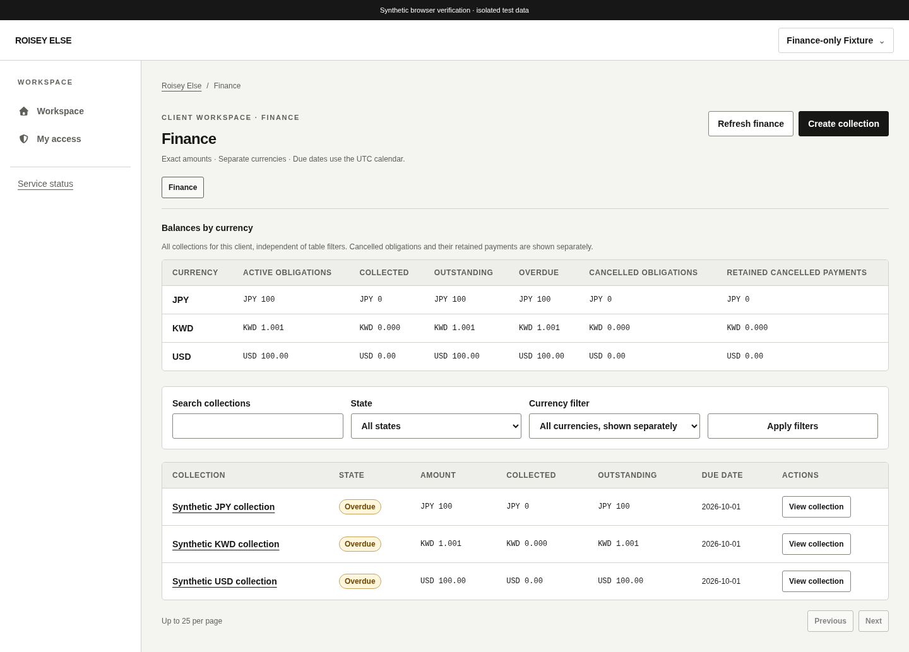
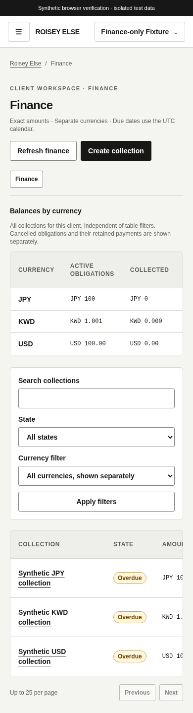

# Finance workspace

The [pricing interface](pricing-interface.md) adds retained, cost-free terms in finance detail and locks copied collection amounts immediately before payment. Failed origin lookup keeps amount read only until a retry confirms manual origin. Other collection/payment/cancellation behavior described below remains unchanged.

Issue [#20](https://github.com/theroisey/else/issues/20) consumes the owner-merged [exact billing API](billing.md). The [interface policy](https://github.com/theroisey/else/issues/20#issuecomment-5957528481) precedes implementation. PR #62 merged at `26f2454`; both permanent development branches were synchronized and main [run 37038850280](https://github.com/theroisey/else/actions/runs/37038850280) passed. No backend, migration, dependency or deployment change belongs to this interface slice.

## Routes and authorization

`/app/clients/:id/billing` shows currency-separated server totals and a bounded collection table; `/new`, `/:collectionID`, and `/:collectionID/edit` add creation, retained history and profile editing. Client Overview links to Finance only with actual `billing.view`. Direct finance routes work for billing-only actors without querying client profiles or unrelated directories. Cross-module links require their independent grants. Audit links additionally require global `audit.view` and this client's `clients.view`.

Reads require exact-client `billing.view`; creation, editing/payments and confirmed cancellation independently require create/update/delete. Legacy manage and role names imply none. Actor/grants/client partition all finance queries; response validation checks canonical money/revisions, real calendar dates, reviewed currency scales, resource/client binding and page ordering. Backend authorization remains decisive. Grant loss clears private finance components, references and recovery state, while unrelated module forms retain their established grant-change behavior. Failed reads never render stale financial detail.

When authorized client metadata says archived, changes are disabled. A billing-only actor cannot inspect that profile; the backend rejects new writes while retaining finance reads and committed-command reconciliation. Fully paid collections retain metadata editing; cancelled collections are read only. Currency is fixed after creation and amount is fixed after the first payment.

## Exact amounts and server calculations

Amounts are text inputs in explicit major units. Plain positive decimals convert through strings/BigInt to canonical minor-unit strings; signs, separators, exponents, zero, excess fractional precision and int64 overflow fail before transport. Leading zeroes normalize; no input is rounded. The validated server catalog supplies USD/EUR/GBP/TRY (2 places), JPY (0), KWD (3). No default currency is selected.

Money formatting inserts decimal places and grouping into strings, never converting amounts or revisions to Number. Aggregate totals above int64 remain exact. Balances and statuses come from the backend; frontend arithmetic only validates contracts and input bounds. Summary rows show active obligations, collected/outstanding/overdue balances, cancelled obligations and retained cancelled payments separately per currency. There is no grand total, FX conversion or revenue chart. Summary scope is all client records regardless of table filters. The table filters descriptions, status and currency; cursor pages contain at most 25 rows. Due dates and payment dates use the UTC calendar; recorded timestamps use the device timezone. Payment pages are in UUID order, not chronology.

## Payment confirmation and recovery

The record-payment form validates amount, current outstanding bound, date, method and optional reference/note before sending one normalized UUID command with the displayed exact revision. Writes are never automatically retried. The modal reports completion only after a validated API success or a matching immutable payment found in history.

If a response is lost, malformed or reports a server failure, the command remains frozen in component memory above application page routes. The modal blocks a second payment and retains the identical command through in-app Back navigation. An explicit retry sends the original UUID, revision and every payload field unchanged, allowing the backend to replay the committed payment without another ledger/audit event. A retry conflict after an uncertain outcome keeps recovery open; it never switches to a new command. History reconciliation verifies original command, actor, payload and expected resulting revision, one bounded page at a time. No matching record is not proof of noncommit; recovery remains unresolved and directs the operator to reconcile rather than replace the payment.

A definite first-request rejection reports safe feedback and returns to refreshed current data before another attempt. References and notes never enter recovery messages. An unload warning explains the memory-only recovery limit. Reload, closing the application, leaving its auth route tree, or identity/grant changes discard private commands; after any such interruption, reconcile recorded history before submitting a replacement. There is no localStorage/sessionStorage draft, command or reference persistence. Session/grant loss suppresses late successes. The recovery controller resets independently, preserving unrelated planning/reminder draft behavior.

Cancellation requires a modal explaining permanent closure of the remaining obligation, retained history, no refund and no reopening. Confirmed API success refreshes finance data and reports cancellation. The interface cannot delete or edit payment history and creates no fabricated billing activity; the existing activity projection intentionally excludes billing events.

## Sensitive history and review

References are absent from list/summary displays, URLs, logs and success text. Authorized payment history masks them as “Reference hidden”; each explicit Reveal control inserts only that payment's reference, with a Hide control. Hidden references are absent from rendered text, labels and tooltips. Reveal state resets with page or access context. Payment notes stay in authorized detail. Inputs explicitly discourage credentials and full card/account details. Screenshots contain labelled synthetic records with references hidden.

The shared table regions support keyboard focus and horizontal scrolling on narrow screens. Loading, empty, failed, denied, pending, confirmed and immutable states are represented; forms use labels and safe validation feedback; shared dialogs retain keyboard focus.

[Tablet](screenshots/finance-tablet.png), [masked payment history](screenshots/finance-payment-history.png), [cancellation confirmation](screenshots/finance-cancellation.png).

Verification covers all six precision scales, canonical int64 and revisions beyond JavaScript's safe range, aggregate formatting above int64, invalid dates, wrong-client responses, independent permission combinations, partial payment/cancellation, masking, revoked access, stale conflicts and unknown-outcome replay/history. The eleventh real-API browser flow commits a payment before discarding its transport response, replays through Back navigation, proves one payment/event, checks immutable paid amount and cancellation history, denies archived writes, revokes access and captures desktop/tablet/mobile layouts. Local browser verification uses disposable PostgreSQL 17.11 and system Chromium; final-head CI supplies PostgreSQL 18 and container/migration gates before owner review.
