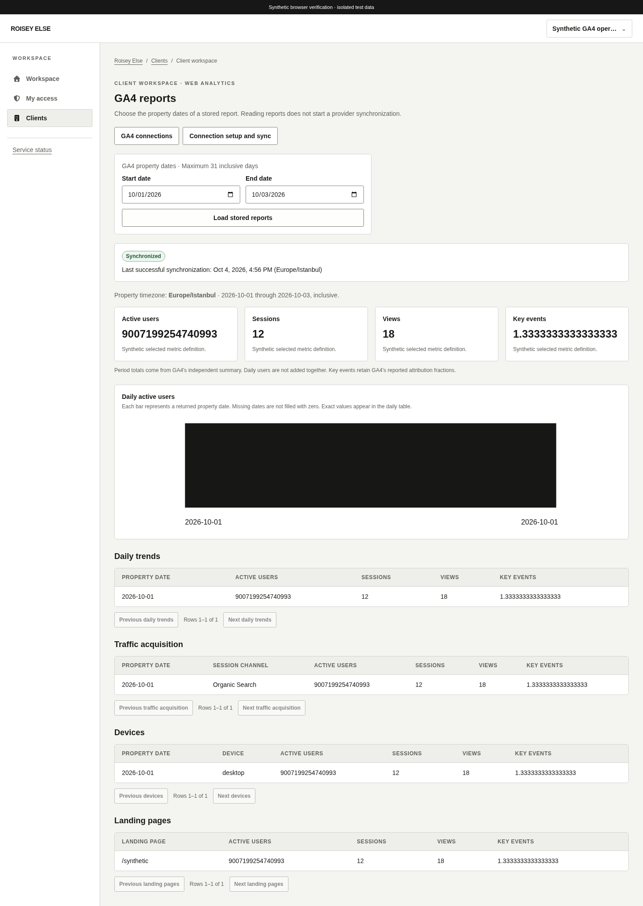
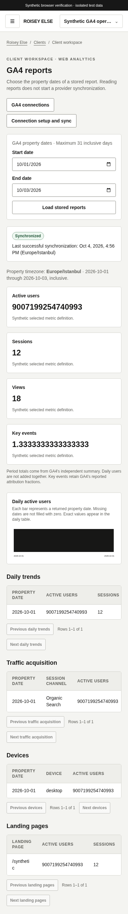

# GA4 workspace

Related: existing [#26](https://github.com/theroisey/else/issues/26), [synchronization API](ga4-synchronization.md) and [metric contract](ga4-adapter.md).

Client profiles and overview navigation expose **Web analytics** with independent `clients.view` and `analytics.view` access. `/app/clients/:id/analytics` lists 25 safe GA4 connections per UUID keyset page. `/app/clients/:id/analytics/:connectionID` reads an explicitly selected property date range of at most 31 inclusive days. Reading does not contact Google or start synchronization. Integration grants are not inferred from analytics access.

Reports show GA4's independent period summary, daily active-user chart and exact table, session-channel acquisition, devices and aggregate landing pages. Tables display 25 local rows per page from bounded complete stored reports. Period users are never calculated by summing daily users. Counts and attribution fractions stay exact decimal strings; only bounded chart coordinates use Number. Empty observations stay empty. Selected metric definitions render as plain text. Landing paths remain escaped text, never links. No conversion rate or anonymous-traffic claim is inferred.

Dates remain GA4 property-local dates, with the measured timezone shown. Last-success and connection metadata instants display in Europe/Istanbul; underlying UTC values retain precision. Queued/running/failed/not-synchronized status, last success and stale data are explicit. A failed refresh can retain previously successful reports with their actual age. Loading or failed reads hide cached reports. Actor, grant, client, connection and period partition queries; loss of access removes old records and forms.

Authorized integration managers on active clients can add an immutable pending GA4 property. Its detail page accepts a read-only service-account JSON key (16 KiB), an explicit date range and installation confirmation. Replacement warns that older work is canceled and previous-generation reports become unavailable. Connected records can queue the chosen range with the saved key. The server independently checks authority, CSRF/origin, revisions and admission.

Keys are held only in an uncontrolled textarea and the short-lived request path, never React state, query cache, browser storage, URLs or error text. Submission clears the field immediately; closing or replacing the form removes it. JavaScript strings cannot guarantee immediate physical memory erasure. Writes never retry automatically. An uncertain/conflicting/unavailable response disables further writes until fresh connection data is loaded, and the key must be supplied again. Saving shows queued status, not verified Google access. Protected server encryption configuration and a supervised worker from the same application image are required for successful setup and collection.

No runtime package or application image is added. Contract/component tests use explicitly synthetic reports, including counts above JavaScript's safe integer limit and fractional key events. Browser coverage creates an audited pending property and checks unconfigured-keyring refusal, empty status, independent analytics permissions, revoked access and responsive layouts against actual Go/PostgreSQL. Synthetic fixtures and local tests do not establish live Google credentials, deployed egress or actual property ownership.

## Verification

All 474 frontend tests, lint/typecheck/build, compiled-Go CSP probes and 16 actual API/database browser flows pass. A subsequent table wrapping adjustment also passes its focused GA4 browser flow and fresh built-artifact CSP probes. The initial combined-image Compose rehearsal passes; final review-head CI and artifact checks remain separately tracked in [PR #126](https://github.com/theroisey/else/pull/126). Local browser verification used only an isolated generated copy on port 5177 and system Chromium, preserving the user's existing 5173 listener.

The following views contain **synthetic stored report fixtures**. They verify rendering and actual API report reads, not live Google access or collection.

