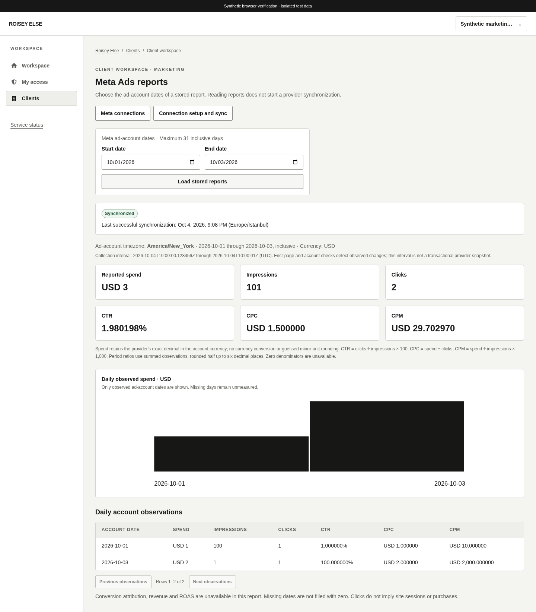
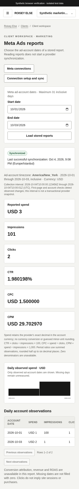

# Measured Meta workspace

Client Marketing routes list safe Meta metadata and read stored account-level daily observations. Integration managers can create a permanently bound pending ad account, install a compatible manually provisioned ads_read user token, or explicitly queue the saved token. Setup is encrypted background verification; pending/queued states do not imply provider access.

Choose explicit inclusive **ad-account dates**, maximum 31 days. The measured account timezone and currency are shown; dates are not substituted with UTC or Europe/Istanbul dates. Operator synchronization timestamps display Europe/Istanbul, and the actual bounded collection interval displays UTC. Spend retains exact provider decimals without currency conversion or guessed minor-unit rounding. Counts remain strings beyond JavaScript's safe integer range; weighted CTR/CPC/CPM use BigInt arithmetic, six-decimal half-up rounding and unavailable zero denominators. Missing days stay unmeasured. Conversion attribution, revenue and ROAS are explicitly unavailable.

Daily tables paginate 25 rows and scroll within their own container. The chart draws only observed spend using bounded coordinates; exact labels remain strings. No observation card appears as a fake measured zero for an empty report. Queued/running/failed/stale/never-synchronized states and last successful observations remain visible. Failed refresh can retain the prior valid report; loading, failed reads, changed periods and revoked grants hide cached content. Query keys bind actor, grants, client, connection and period.

The password token input is uncontrolled, never React state/cache/URL/browser storage. It clears before local validation or requests and on unmount/access loss. Uncertain writes disable replay until refreshed current metadata. Setup confirms authorized user-token provenance; the server independently checks ads_read and account context during collection. No automatic token refresh or business retry. Local disconnect instructions retain manual remote revocation.

Synthetic unit/flow tests exercise exact metrics, privacy, permission changes, period partitioning, pending creation, cleared invalid tokens, single CSRF mutation and uncertain outcomes. The real Go/API/disposable PostgreSQL browser flow additionally checks audited pending creation, missing-keyring refusal, stored measured reads, desktop/mobile overflow, and revoked access. These fixtures establish implemented behavior, not actual Meta credentials or production activation. Final verification results and main CI references are recorded in existing #25.

## Local verification — 2026-10-04

All **518 frontend tests**, lint/typecheck and the production build pass. Actual Go-served production CSP/attack checks and **18** real API/disposable PostgreSQL browser flows pass (2.1 minutes), including the new Meta flow. The isolated source copy uses port 5177 and installed Chromium to preserve the user's port-5173 server; production routes and authorization remain unchanged. All ordinary Go race tests and ordinary/integration vet pass. The complete PostgreSQL 18.3 race suite passes in **523.670 seconds**, including actual archive restores, current/prior/current compatibility, all three provider lifecycles and compiled security denials. The candidate application image builds and passes all runtime TLS/privilege/migration/outage/persistence/header/release/key/operator checks. That local rehearsal reuses the exact already-built candidate to fit the managed Docker VFS disk budget; final committed-main CI/publication is separately required.

Desktop 1440 and mobile 390 captures show deliberately synthetic data from that real-browser flow, visually inspected for exact metrics, status, account-local periods, explicit unavailable attribution and local table scrolling. The visible provenance banner is test-only:

