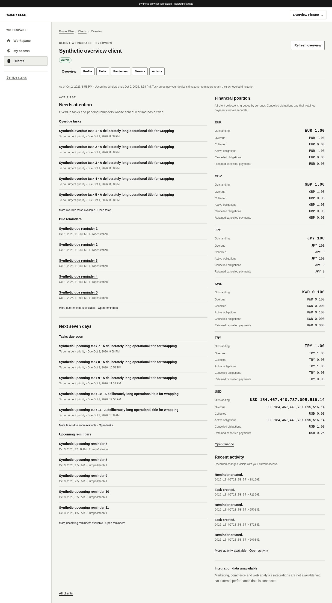
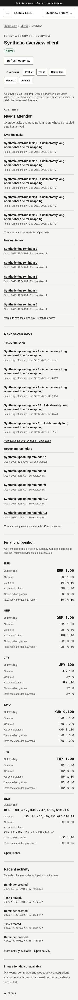

# Client overview and operational attention

Related Issue: [#23](https://github.com/theroisey/else/issues/23). Backend PR #66 is owner-merged at `378e5cf`; main [run 37060547663](https://github.com/theroisey/else/actions/runs/37060547663) passed and both development branches synchronized. The [frontend policy](https://github.com/theroisey/else/issues/23#issuecomment-5960954840) preceded implementation. This slice consumes the [overview API](client-overview.md) without backend, schema, grant or audit changes.

## Hierarchy and navigation

`/app/clients/:id` is now the operational overview: compact client name/status, refresh instant/window, urgent attention, the next seven days, currency-separated finance and recent real activity. Desktop places finance beside the attention column; tablet/mobile stack the sections. No uniform KPI grid, invented totals or chart is introduced. Long titles and exact amounts wrap without page overflow.

Task/reminder rows open their existing detail routes. Sixth-row indicators link to the complete source workspace, without invented pagination or total counts. Module navigation requires current local access and an actual server projection for finance, tasks, reminders and activity. Planning/pricing/audit destinations retain their existing permission gates. Unimplemented marketing, commerce and web analytics integrations have an explicit unavailable explanation with no metrics or dead links.

The separately linked `/app/clients/:id/profile` preserves full profile, contacts, timestamps, edit links and archive confirmation. Client create/edit still returns to the main overview with confirmed success feedback. Existing revision, conflict, archival and audit policies remain unchanged. Archived overview/profile reads retain history and expose no overview mutation controls. The profile return destination is narrowly allowlisted for login recovery.

## Access and private data

Exact-client `clients.view` is required before any overview read. Query keys include actor, serialized current grants and client; the page remounts on that context. Current grants and server presence independently gate each module. Activity additionally reuses source-module permission filtering; removing hidden rows also suppresses an unsafe more indicator. Missing modules are omitted, while authorized empty queues and empty financial history have explicit text.

Pending, refetching, failed or malformed data hides previous private content. Refresh first rechecks the real session, then performs one overview read in the resulting context. A changed identity/grant signature starts a new partition instead of refetching the old one. Reads verify fresh session context before caching. Session loss clears private queries; overview has zero inactive retention and no browser storage. Other domain drafts and existing financial recovery controllers keep their own lifecycle.

## Strict read contract and cost

An initial load or explicit refresh uses one bounded GET `/api/v1/clients/:id/overview`; returning from a source workspace performs one fresh overview read. There are no profile, owner/directory, source-list or finance-summary requests on this page. The shared authenticated transport adds its ordinary session checks, no-store, same-origin cookies, redirect rejection and ten-second cancellation/timeout.

The query yields one microtask before consuming its abort signal, allowing React's development effect replay to share the initial promise without duplicate HTTP reads. It then retains query cancellation and the usual context checks. StrictMode flow tests and real navigation request measurements cover this behavior.

Before rendering/caching, strict Zod validation checks the compact client binding/status/archive instant, canonical UTC dates and exact 168-hour horizon at microsecond precision. Queues have at most five distinct UUIDs, a sixth-row indicator only when full, correct deadline buckets and stable timestamp/UUID ordering. Terminal tasks, later schedules, duplicate IDs across queues and unknown/private fields fail closed. Reminder display uses its validated stored timezone. Activity reuses the existing static-label/resource schema, checks client binding and newest-first order, and preserves exact UTC event text.

Finance reuses the existing billing Totals schema and exact string/BigInt invariants, including exponent, active amount = paid + outstanding, overdue <= outstanding, retained cancelled payments <= cancelled obligations, unique ordered currencies and totals above int64. Formatting uses the existing exact money formatter. Every source field remains visible by currency; cancelled values stay separate. No Number arithmetic, FX/grand total, pricing revenue, costs, notes or payment references are added. Exact indexed ledger scanning remains a backend cost; one frontend request does not imply constant database work.

## Verification and review evidence

All 380 frontend tests pass, including 36 overview service/StrictMode flow cases alongside existing regressions. Coverage includes all 16 module combinations, missing/foreign client grants, malformed/private envelopes, exact microsecond boundaries, wide finance, safe activity masking, archived/empty states, safe errors/retry, refresh request counts, grant/actor changes, late responses and session loss. Typecheck, lint, production build and backend race checks pass locally.

The thirteenth real-API browser flow creates synthetic tasks, timezone reminders, all six financial currencies and retained cancelled payments through the authenticated APIs. It compares the overview's finance with the source summary, checks amounts above int64, all four five-row queues, no read audit writes, one measured aggregate request on refresh and return navigation, keyboard detail navigation, safe errors, revoked finance/tasks/client access and archived/profile history. Existing twelve browser flows also remain required. Local verification uses disposable PostgreSQL 17.11/system Chromium; final-head CI supplies PostgreSQL 18 and container/TLS/migration gates before owner review.

Synthetic desktop, 820px tablet and 390px mobile screenshots verify contained layouts, with empty and failed mobile states. Shared semantic navigation, heading hierarchy, lists, labelled refresh/retry controls, dateTime values and keyboard focus provide the accessibility foundation.

[Tablet](screenshots/overview-tablet.png), [empty overview](screenshots/overview-empty.png), [safe mobile error](screenshots/overview-error-mobile.png).
