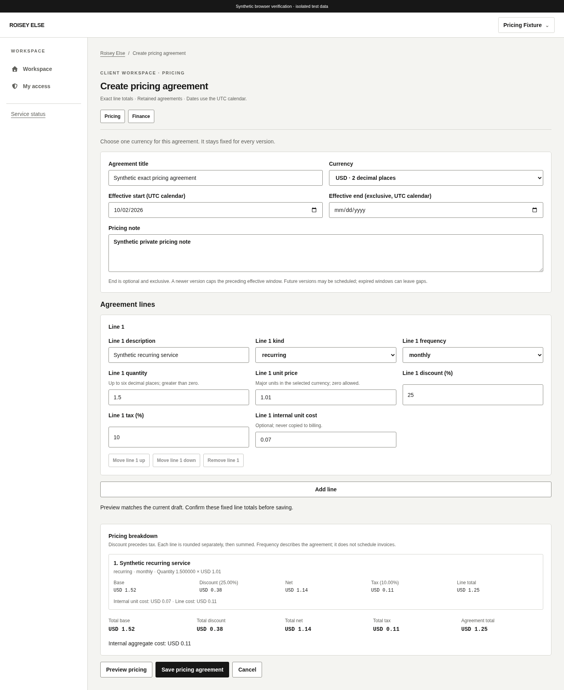
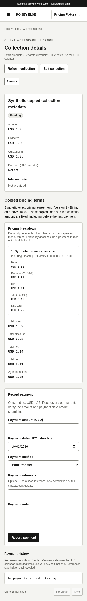

# Pricing agreements, version history and collection copies

Related Issue: [#21](https://github.com/theroisey/else/issues/21). Backend PR #64 was owner-merged at `2405d39`; main run 37049174588 passed and both development branches synchronized. The [frontend policy](https://github.com/theroisey/else/issues/21#issuecomment-5959050907) preceded implementation. This interface consumes the [pricing contract](pricing.md) without API, schema, permission-catalog or audit changes. Owner review remains required before merge.

## Access and navigation

Client pricing routes support agreement lists, creation, the latest version, a retained version and a complete new version. Exact-client `pricing.view` permits reads; preview/create/append also require `pricing.manage`. Collection copies require pricing.view, billing.view and billing.create together. Users without clients.view open pricing directly without probing profiles. With profile access, archived or failed context disables new writes; the backend remains authoritative for profile-free access and every write.

Queries and drafts are partitioned by actor, current grants and client. Grant changes hide costs, remove write controls and reset private forms; context changes suppress late responses. Costs appear only for managers and never enter billing snapshots, navigation, notifications or logs. Billing-only users retain copied terms without pricing reads. No browser storage holds drafts or recovery commands.

## Exact forms and previews

Explicit sheet currency is USD/EUR/GBP/TRY (2 decimals), JPY (0) or KWD (3), fixed after creation. One to fifty ordered lines support recurring, one-time and custom kinds with descriptive frequencies. Add, remove and reorder affect only the unsaved draft; retained versions have no edit/delete/reorder action.

Positive quantity accepts up to six decimal places. Nonnegative unit price and optional cost accept the currency's exact scale, including zero. Discount and tax accept 0–100% with up to two places. Plain text converts to canonical strings using BigInt; excess precision, signs, exponent notation and overflow are rejected instead of rounded. Server line totals and summed totals are authoritative. Responses validate binding, scales, order and exact arithmetic before display or caching. Aggregate internal cost is unknown when incomplete.

A current server preview is required before saving; changing any field invalidates it. Append submits the complete profile with the exact latest sheet revision. Stale or uncertain writes freeze the attempt and require history review. A lost response may have committed: no automatic repeat or revision substitution is inferred safe.

## Effective history

Latest revision can be future-scheduled. Retained history shows original dates, derived exclusive end, same-day supersession and current/historical/future status. Successors cap earlier windows without rewriting original records; gaps stay inactive. Agreement/history queries use 25-row cursor pages; history sorts latest-first within each UUID-ordered page. A copy selects a billing date within the retained version's window, no later than UTC today. Zero-total versions cannot create collections.

## Collection confirmation and recovery

Copying confirms the server total, billing date, optional due date and internal note. One command retains original UUID, actor/client context, sheet/version, latest sheet revision and normalized payload above application page routes. In-app Back preserves recovery and blocks replacements while sending or unresolved.

Only validated success confirms creation. Lost, malformed or server-error responses leave the outcome unconfirmed. Explicit retry sends the identical command; committed replay returns the original collection without another audit event. A conflict after an uncertain outcome stays unresolved and directs authorized manual reconciliation. No new UUID or revision is substituted. Definite initial rejection returns to current pricing for review. Notes stay hidden in recovery messages.

Recovery exists only in memory, with an unload warning while unresolved. Reload, closing the application, leaving the auth route tree, signing out or identity/grant changes discard the command; reconcile retained financial history before creating a replacement afterward. No automatic invoices, recurring execution, FX, refunds or automatic retries are added.

## Copied terms in finance

Finance detail retains title, pricing revision, billing date and exact copied line breakdown. A source-version link requires pricing.view; costs and pricing notes never appear. Later pricing changes leave collection amounts and copied lines unchanged.

Copied amount is read only immediately, including before payment. Origin lookup is required before permitting manual amount edits; errors keep it read only with explicit retry. A snapshot 404 implies manual origin only after fresh accessible collection detail confirms the record. Existing metadata, payment and cancellation rules remain in force; collection DTO and payment recovery are unchanged.

## Review evidence

All 344 frontend tests cover exact conversion, response integrity, masking, independent grants, preview invalidation, append conflicts, effective windows, replay, archived writes, failed/empty reads and conservative snapshot failures alongside existing regressions. Twelve real-API browser flows use a disposable database; pricing proves one collection/event after lost-response Back/replay, read-only unpaid amount, retained terms after append, same-day supersession and access revocation. Local verification uses PostgreSQL 17.11/system Chromium; final-head CI supplies PostgreSQL 18, migration and container/TLS gates before owner review.

Shared forms/dialogs provide labels, keyboard focus and loading, empty, failed, denied, disabled and confirmed states. Synthetic desktop and 390px mobile screenshots pass horizontal overflow checks.

[Mobile form](screenshots/pricing-form-mobile.png), [agreement and history](screenshots/pricing-history-desktop.png).
