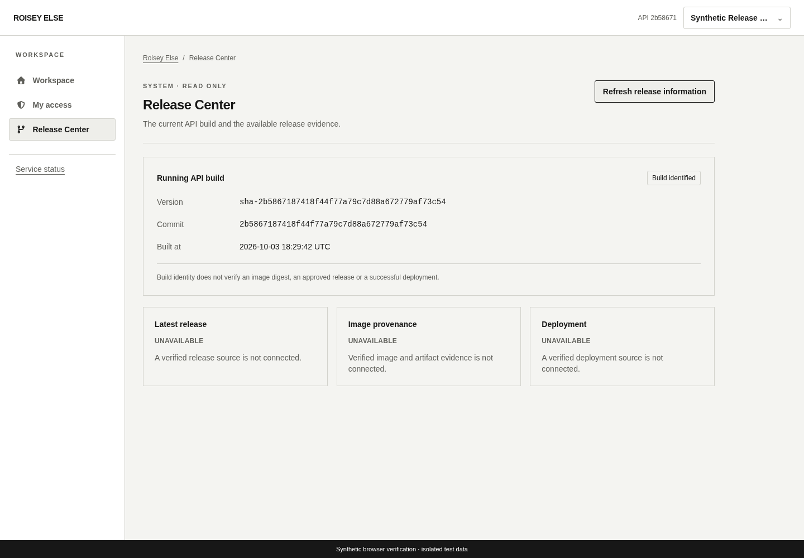
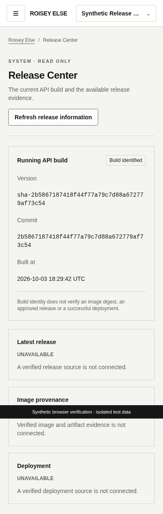

# Release Center interface

Frontend [#93](https://github.com/theroisey/else/issues/93) completes the read-only interface under parent #29, using [backend #92's release contract](releases.md). `/app/releases` and navigation require current global `releases.view`; client-only grants do not authorize release metadata.

The page identifies the running API build with its full SHA version, commit and exact UTC build timestamp. A restrained shell link shows the short API revision on wider screens; narrow screens keep the Release Center in navigation. Missing valid embedded metadata is explicitly unavailable. Latest release, image provenance and deployment each have separate unavailable panels because no verified observation source is connected. Build identity alone never certifies an approved release, image digest or rollout. No update, import or deployment controls exist.

## Reads and recovery

Use only the same-origin protected GET `/api/v1/releases`, with no query, caller-selected source, browser persistence or remote request. Strict bounded validation accepts a coherent sha-version/40-hex revision/canonical UTC stamp, or unavailable with null fields; unknown fields/statuses and malformed timestamps fail safely. Server messages and arbitrary response text are never displayed.

Page and shell share one identity/grant-scoped query. Reads use existing current-context checks, no-store transport and cancellation; changing identity/grants cannot reuse the old report. On 401/403 the existing session refresh removes revoked or expired access. Loading and failures hide prior metadata; failure offers explicit refresh, with no automatic retry or mutation. Session expiry returns to real sign-in. The refresh control supports keyboard operation and disables during loading.

## Verification

Unit tests cover exact validation, unavailable states, safe manual recovery, deduplicated protected reads, client-only denial, revoked grants, session expiry and late responses from an old identity. The full frontend suite, lint/typecheck and production build remain required.

The real-API browser flow provisions a clearly synthetic global release reader in disposable PostgreSQL, logs in through the real cookie API, checks the stamped checkout revision/build time, confirms reads add no audits, exercises keyboard refresh and desktop/mobile widths, and revokes the grant to verify API/UI denial without cached metadata. The browser runner stamps its API with the same strict helper and passes expected inputs to Playwright. Screenshots are labelled synthetic and contain no credentials. All five exact-head CI gates accompany separate backend/frontend review. No production execution, rollout or deployment is performed.

Local verification passed 448 frontend tests, lint/typecheck/build, and the actual stamped API/disposable PostgreSQL 18.3 browser flow using installed Chromium on isolated alternate ports. The existing developer listener remained untouched. CI repeats the complete browser suite with its pinned Chromium. The local screenshots below show synthetic data and a real tested API revision; their build timestamp is an observation, not deployment evidence.

