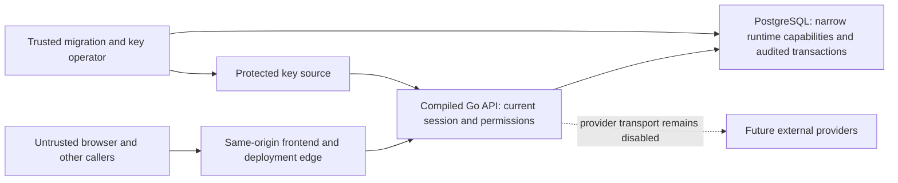

# Implemented-system security review

Related: [#98](https://github.com/theroisey/else/issues/98), part of [#30](https://github.com/theroisey/else/issues/30). Reviewed on 2026-10-03 against the implemented system at main `9a89158` plus this test/documentation slice. This is a threat model and executable control review, not a penetration-test certification or production approval. Owner closed #24; that administrative closure does not enable provider setup, OAuth, synchronization or remote revocation.

## Assets, actors and trust boundaries

Protected assets are customer operational/contact records, exact finance and internal costs, identities/grants, session verifiers, append-oriented audit history, encrypted provider credentials and permanent encryption accounting, protected key files and release evidence. Public health/connectivity observations and static frontend assets have a separate exposure boundary.

Actors include an anonymous caller, a malicious site initiating browser requests, an authenticated user with no grants, a user authorized on a different client, a privileged administrator and a trusted migration/key operator. Compromised runtime credentials and accidental restore/configuration errors are also considered. The database owner, operating system and deployment control plane can defeat application controls; they are trusted operational boundaries requiring independent access/backup controls.

The edge-to-API and API-to-database boundaries require production TLS and reviewed identities. Local loopback HTTP in the integration test is an explicit development exception. Request JSON, IDs, cookies, headers, stored customer text and future provider payloads are untrusted; identity comes from the current database-backed session, never an actor supplied by the caller.

## Threats, controls and evidence

| Threat | Implemented controls and review evidence | Disposition / remaining limit |
| --- | --- | --- |
| Credential guessing, enumeration or stolen sessions | [Identity contract](identity.md): bounded Argon2id parameters, identical credential errors/dummy work, independent 256-bit session/CSRF values stored as digests, absolute expiry, fresh user/session state and revocation. `identity_test.go`, `internal/identity/credentials_test.go` and compiled matrix. | Application controls verified. MFA, recovery, session retention and privileged-account policy require separately defined scope; no MFA guarantee. |
| CSRF, hostile origin or credentialed cross-origin request | Exact configured Origin and JSON on unsafe requests; authenticated writes also require header/cookie agreement with the server-side session digest. Secure host-only HttpOnly/Strict session cookie; readable CSRF cookie. Compiled matrix covers wrong Origin, absent CSRF, mismatched header and another session's matching cookie/header. | Verified route-family guard coverage. SameSite supplements these checks. TLS, same-origin routing and production cookie policy remain deployment requirements. |
| Privilege escalation or cross-client ID substitution | Fresh permission checks in protected services/database functions; no role-name authority or frontend-only checks. Exact client context; opaque 404 for inaccessible client resources. Global audit/release/admin authority remains independent. `authorization_test.go`, `administration_test.go`, domain boundary suites and compiled matrix. | Verified implemented families and immediate grant/session revocation. Matrix is not exhaustive over every method, nested resource or malformed input. |
| SQL injection or compromised runtime identity | Bound query arguments, strict IDs/filters, fixed-search-path security-definer functions, PUBLIC revocation and explicit runtime grants. API lacks migration owner/key operator credentials. `database_test.go`, domain storage-boundary tests and [grant source](../backend/scripts/grant-runtime.sql). | Reviewed implemented query boundaries and tested provisioned grants. Database owners/operators are trusted; production role membership/grants must be rehearsed under #32. |
| Unauthorized ledger/audit rewrite, lost updates or partial commits | Revision/generation CAS, explicit lifecycle/command rules, exact decimal amounts, retained history and atomic typed business/audit transactions. `billing_boundaries_test.go`, `billing_races_test.go`, `pricing_boundaries_test.go`, `pricing_races_test.go`, `audit_test.go`, task/planning/reminder race suites. | Existing domain evidence retained; compiled matrix fingerprints every ordinary `app` table around denied batches, including audit, sessions, roles and credentials. This does not prove arbitrary race schedules or owner-proof storage. |
| Secrets/customer input in errors, logs or caches | Fixed public errors, no-store JSON, nosniff, fresh server-owned correlation IDs, fixed route labels and safe structured diagnostics. Typed audit allowlists exclude credential state. `internal/http/middleware_test.go`, `audit_test.go` and compiled matrix. | Synthetic body/query/header/Origin/token/password sentinels stay out of compiled responses/logs. No claim about deployment-edge or third-party telemetry logs. |
| Stored/reflected XSS, clickjacking or script compromise | React text rendering; reviewed source has no `dangerouslySetInnerHTML`/raw innerHTML sink or token persistence in browser storage. [Same-origin transport](frontend-foundation.md) rejects redirects/raw response errors. Session HttpOnly protects token confidentiality. | HttpOnly/CSRF do not stop malicious same-origin scripts acting as the user. Current `frontend/nginx.conf` does not supply CSP/frame/HSTS policy; production edge/header review and browser proof remain required under #30/#32. Source inspection is not browser exploit proof. |
| Brute-force/resource exhaustion | Bounded in-process login buckets/attempts, JSON/page/cursor limits, configured header/read/write/idle deadlines and bounded pool. `internal/identity/ratelimit_test.go`, HTTP/config tests and domain validation suites. | Login limiter is per-process and direct-peer/email based; it does not prevent distributed attacks or email spraying. Trusted edge limits and load/resource testing remain #31/#32 requirements. |
| Provider token swap, stale writer or encryption-accounting rewind | AES-GCM binding to client/connection/provider/purpose, irreversible per-key reservation, lifecycle locks and fresh revision/generation fences, protected Linux key source, declared-restore preflight and bounded rotation/inventory. `integration_budget_test.go`, `integration_vault_test.go`, `integration_key_preflight_test.go`, `integration_rotation_test.go`, `integration_key_inventory_test.go`. | Undeclared restores/clones cannot be detected; fresh independent keys and retained backup-key inventory are operator requirements. Live inventory does not authorize key retirement. Provider transport/OAuth/SSRF/remote-revocation controls must be reviewed before #25–#27 enable them. |
| Malicious or inconsistent external Insights data | [Pure Meta decoder](meta-insights.md) bounds pages/rows, rejects ambiguous JSON and validates trusted account/currency/calendar context with exact arithmetic. No network/credential/storage route is added. | Verified parsing primitive only. No live provider/account-ownership, authorization, credential or ingestion proof. |
| Supply-chain compromise or vulnerable dependency | Exact toolchains/lockfiles, pinned Actions/container bases and five required CI verification gates. npm 11.19.0 full-lock audit on 2026-10-03 found zero advisories across 306 dependency entries. | Go vulnerability scan has **no result**: govulncheck v1.1.4 could not fetch `vuln.go.dev/index/modules.json.gz` under enforced policy. Official Go vulndb snapshot build also failed on blocked dependency destinations; no substitute/incomplete database was used. Parent #30 stays open. |
| False release/deployment assurances | CI-stamped immutable API metadata, fresh global release permission and explicitly unavailable latest-release/image/deployment observations. `releases_test.go` includes actual compiled and container evidence. | PR/main build success is not rollout or provenance/backup/rollback rehearsal. #32 needs an explicit environment and production authorization. |

## Compiled denial matrix

[`TestSecurityCompiledAPIDenialMatrix`](../backend/tests/integration/security_matrix_test.go) builds the production API with `scripts/build-api.sh`, applies the actual runtime grant file to a private role, and starts it on a random loopback port against disposable PostgreSQL 18.3. Synthetic administrator, authenticated zero-grant and client-A-only reader sessions come from the real identity service. Positive current-session, directory/admin/audit/release and every client-domain read distinguish working adapters from accidental blanket failures.

The matrix covers anonymous and zero-grant reads for clients, users, roles, permissions, global audit and releases; client detail/tasks/plans/reminders/billing/pricing/activity/overview/integrations/client audit; client-B isolation; and 16 representative mutation paths across clients, tasks, planning, reminders, billing, pricing, disconnect, account/role/assignment administration and logout. Each mutation has anonymous, wrong-Origin, absent-CSRF, mismatched-CSRF and foreign-session-CSRF cases. The same cookies lose access after grant revocation and after session revocation.

Denials must have exact status/code, fixed safe messages, a bounded error-only JSON envelope, matching fresh server-owned correlation, no-store and nosniff. Request input and session/CSRF/database-password sentinels must not appear in responses or captured API logs. Full application-table fingerprints must remain unchanged around each denial/read batch; the explicit trusted revocations occur between batches. Logs are inspected only after the owned subprocess exits, avoiding races with the capture buffer. Cleanup removes only owned test resources.

This is a route-family regression matrix. Existing handler/domain tests retain deeper method/resource validation, expired/disabled sessions, delegation, concurrency, audit-failure rollback, private SQL grants and migration checks. Login success/browser cookie attributes/throttling are covered by identity tests and the Browser authentication gate; this matrix does not reimplement their fixtures or claim every exploit has been exercised.

Run `sh scripts/test-integration.sh` from `backend/` for the complete disposable database suite, alongside `go test -race ./...`, `go vet ./...` and static builds. Record actual local/exact-head CI outcomes in #98/its PR; document edits alone are not verification. Required gates are Frontend checks, Backend checks, PostgreSQL integration, Browser authentication and Container integration. Publication is skipped on PRs.

## Current guidance used

Reviewed official OWASP Cheat Sheet Series commit `6b6a66bae11c9e001c3576bcc3de55cc0dc5e449` (2026-10-03). These are control-design references, not an assertion of complete OWASP/ASVS conformance:

- [Authorization](https://github.com/OWASP/CheatSheetSeries/blob/6b6a66bae11c9e001c3576bcc3de55cc0dc5e449/cheatsheets/Authorization_Cheat_Sheet.md): least privilege, deny by default, per-request server-side authorization and permission tests.
- [CSRF prevention](https://github.com/OWASP/CheatSheetSeries/blob/6b6a66bae11c9e001c3576bcc3de55cc0dc5e449/cheatsheets/Cross-Site_Request_Forgery_Prevention_Cheat_Sheet.md): unpredictable session-bound token verification, exact origin checks and SameSite defense in depth.
- [Session management](https://github.com/OWASP/CheatSheetSeries/blob/6b6a66bae11c9e001c3576bcc3de55cc0dc5e449/cheatsheets/Session_Management_Cheat_Sheet.md): random verifiers, server-side digest storage, secure host-only HttpOnly cookies and revocation. In this application, SHA-256 stores random verifiers; Argon2id hashes passwords.
- [Logging](https://github.com/OWASP/CheatSheetSeries/blob/6b6a66bae11c9e001c3576bcc3de55cc0dc5e449/cheatsheets/Logging_Cheat_Sheet.md): exclude access tokens, session identification values, passwords and sensitive data; retain attributable safe event codes.

## Open acceptance and reassessment

#30 remains open for a successful current Go dependency/symbol scan and disposition of advisories, final evidence and deployment-specific security requirements. #31 owns full implemented critical-flow/performance proof; #32 owns edge configuration, privilege verification, backup/restore/rollback and operating rehearsal. #25–#27 must review newly exposed provider identity, transport, redirect/SSRF, scope, privacy/retention and revocation boundaries before activation. Reassess this model whenever routes, grants, key/restore behavior, providers or deployment topology change. No finding here authorizes production rollout or treats disabled capabilities as complete.
