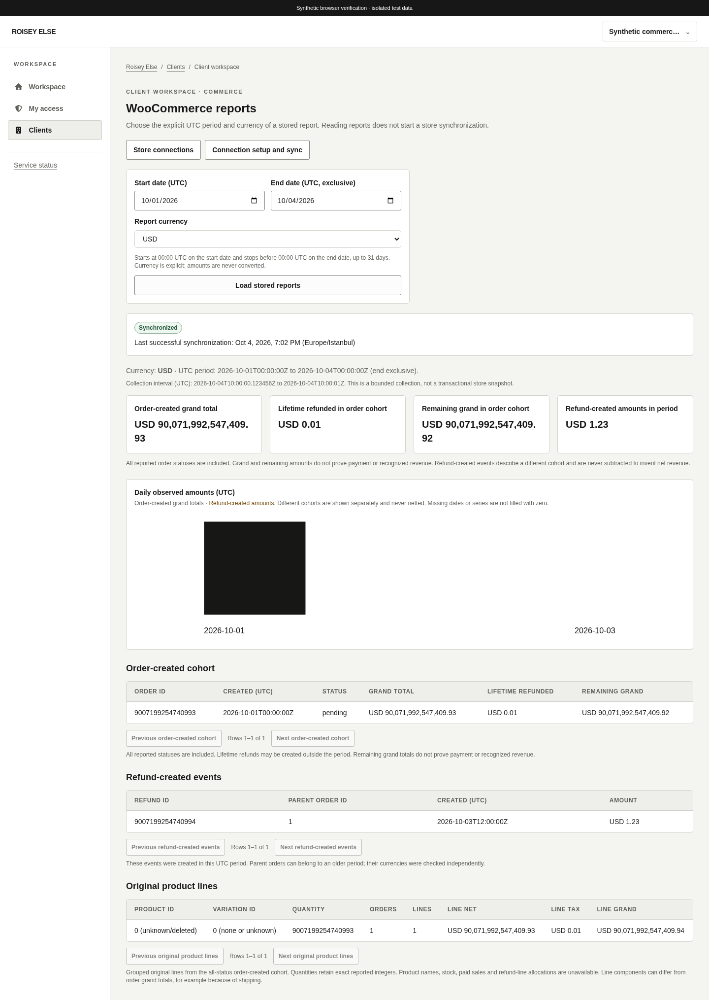
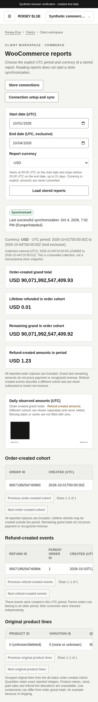

# WooCommerce workspace

Related: existing [#27](https://github.com/theroisey/else/issues/27), [synchronization API](woocommerce-synchronization.md) and [report semantics](woocommerce-reports.md).

**Commerce** is available from client profiles and overview navigation with independent `clients.view` plus `analytics.view`. `/app/clients/:id/commerce` lists 25 safe store connections per UUID keyset page. `/app/clients/:id/commerce/:connectionID` reads one complete stored report by explicit UTC start/end and supported currency. Report reads neither contact the store nor enqueue work. Integration access is a separate permission.

Date inputs choose midnight UTC boundaries: start inclusive, end exclusive, positive period at most 31 days. USD, EUR, GBP and TRY have two minor-unit places; JPY has zero and KWD three. Every report section must match the selected client, connection, period, currency and exponent. The interface never guesses the store timezone, converts currencies or combines their amounts.

The four summary cards show order-created grand total, lifetime refunds within that order cohort, its remaining grand, and separately refund-created amounts. All reported order statuses are included. Neither grand nor remaining totals prove payment or recognized revenue. Refund events can refer to older parent orders and are never subtracted from a different order cohort to fabricate net revenue. Original product lines expose only grouped IDs, exact quantities, order/line counts and line net/tax/grand. Variation zero means none or unknown; product zero means unknown/deleted. Product names, stock, paid sales, conversion metrics and refund-line allocation are unavailable.

Daily bars derive only observed UTC dates and exact BigInt sums from these stored rows. Missing dates and missing cohort series are not filled with zeros. Monetary values and large IDs/quantities remain exact strings; only bounded drawing coordinates use Number. Each report table displays 25 local rows per page. Wide tables scroll within their own container on small screens.

Status shows not synchronized, queued, running, failed or succeeded, last success in Europe/Istanbul and stale reports. Actual collection timestamps retain UTC precision and do not promise a transactional store snapshot. Failed background refreshes can retain a prior successful report within the same credential generation. Loading or failed reads hide cached reports. Queries and completion checks bind actor, grants, client, connection, UTC period and currency; revoked access removes reports and setup forms.

Active-client integration managers can explicitly authorize a pending immutable canonical HTTPS store origin, optionally with the WordPress base path. Creating metadata does not verify access. Setup accepts a dedicated WooCommerce **Read** consumer key/secret and an explicit report selection, with confirmation before encrypted installation/replacement. Both fields are uncontrolled password inputs, clear immediately on submission and unmount, and never enter React state, query cache, browser storage, URL, errors or logs. JavaScript strings cannot guarantee physical memory erasure. The server independently validates keys, authority, CSRF/origin, revisions and admission. A successful setup response means queued work, not verified store access.

Connections with a previously saved key can explicitly request another bounded synchronization, including pending state after a failed first collection. A newly created revision-one connection cannot request saved-key sync from this form. Writes do not automatically retry. Uncertain outcomes disable further writes until current connection/client data is reloaded; installing again requires re-entering the cleared key pair. Protected server encryption configuration and supervision of the existing same-image analytics-worker are required for successful collection.

No package, application image, webhook or production deployment is added. Component and contract fixtures are explicitly synthetic and include integers above JavaScript's safe limit. The browser flow uses real authenticated Go/PostgreSQL pending creation, safe unconfigured-keyring refusal, empty reads, synthetic private stored reports, currency isolation, independent grants and revocation. It does not establish actual vendor access, legal ownership, key scope or production egress.

## Verification

All 497 frontend tests, lint/typecheck/production build, compiled-Go CSP probes and 17 actual API/database browser flows pass. Browser verification used an isolated generated copy of `6f1f85bb` on port 5177 and system Chromium, preserving the user's existing 5173 listener. Only disposable harness port/revision and browser-path selectors were adapted; application source and required security checks were retained. Final single-image and exact-head CI results are separately tracked in the associated PR.

These views contain **synthetic stored report fixtures**. They verify responsive rendering and real authenticated report reads, not actual store access or collection.

