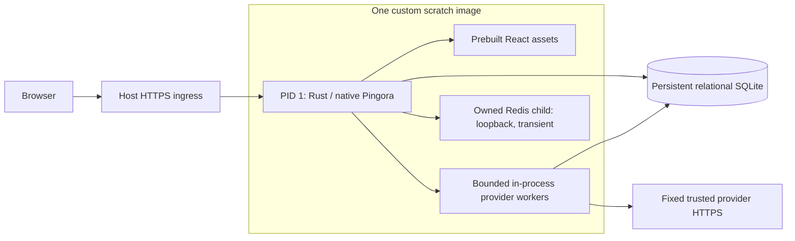

# Architecture and verification

Roisey Else is one modular Rust application with a React frontend. [Domain contracts](domains.md), [providers](providers.md), [operations](operations.md), and [frontend](frontend.md) hold the non-obvious maintenance rules. Current runtime scope/evidence is [#135](https://github.com/theroisey/else/issues/135). Historical decisions remain in Git and their issue discussions; superseded deployment guides are intentionally removed.

## Runtime

Pingora 0.9.0 supplies `HttpServerApp` and the native listener. There is no second HTTP server; Hyper is an outbound HTTP/1 client only. Rust integrates SIGTERM/SIGINT and unexpected child exit with Pingora's bounded graceful drain. Readiness fails before drain; provider tasks use the same shutdown signal. The serving process owns an exclusive filesystem lease. Native operator invocations are explicit temporary commands, not supervised resident processes.

`server.rs` applies exact CSP/frame/nosniff/referrer headers to every response. APIs and private errors are `no-store`. Static assets are validated/confined/snapshotted at startup, accept only shipped types, refuse source maps/symlinks/traversal, and serve deterministic gzip, ETags and hashed immutable caching. Unknown API/asset paths return 404; normal browser routes receive the SPA. Theme initialization remains an ordinary blocking same-origin script.

`Dockerfile` copies only the static Rust musl binary, pinned Redis executable plus its exact five-library ELF closure, built assets, public distribution Mozilla roots, licenses, and an empty privately owned data directory. That directory is an explicit named `0700` artifact; copying empty contents alone does not reliably preserve destination permissions across builders. Both the image and initialized named volumes are checked for private mode and UID/GID 65532 ownership. Nonroot UID/GID 65532 runs on a read-only root with no capabilities or privilege escalation. There is no shell, compiler, Node, source, external supervisor, or updater. A 16 MiB noexec/nosuid/nodev tmpfs provides transient `/tmp`; the named volume alone holds durable state. Initial publication targets Linux AMD64; another architecture requires compiling and verifying its artifact, not relabeling this binary. External host ingress supplies HTTPS.

## Database and resource discipline

SQLite uses STRICT relational tables, foreign keys, WAL, FULL synchronous durability, and checksummed embedded additive migrations. Final files are protected regular single-link/no-follow files; durable DB/WAL files use 0600 and key sources 0400/0600. Eight connections provide seven bounded read slots and reserved capacity for the independently admitted single IMMEDIATE writer; dashboard reads cannot consume its last connection. Current user/grant/client/owner/parent/revision checks run inside the transaction after waiting. Mutations and typed safe audits commit atomically. Database storage guards preserve immutable history; the host/operator remains trusted and can defeat filesystem protections.

Connection/writer admission and SQLite busy waits have two-second bounds. Blocking work runs off Tokio's HTTP workers and retains permits even when the caller future is cancelled. Cancellation/lost responses do not prove noncommit. HTTP work has a five-second handler ceiling, bounded body/header sizes, 128 active request slots, 60-second keepalive and 15-second write bounds. Two admitted Argon2 workspaces preserve the existing 19 MiB/two-iteration/one-lane policy; per-process direct-peer/email login throttling supplements external edge policy. Forwarded identity headers are ignored.

Existing client/time/keyset indexes bound common queries. Pricing creation-token indexes restrict normal write consistency checks to newly created terms; supported recovery still verifies every retained agreement/copy. Finance sums use checked i128 intermediates and return canonical exact strings. Overview uses one read transaction and five-row attention queues; it omits inaccessible modules without revealing counts.

Redis accelerates only sanitized, versioned report reads after fresh SQLite authorization/checkpoint checks. Stored identity/revision/digest and parameters bind cache keys; typed bodies are checked again before return. Four slots, an 80 ms overall deadline, 60 ms I/O, short failure cooldown, five-minute TTL and 2 MiB entry bounds prevent it becoming a request bottleneck. Cache miss/failure falls back to SQLite. Redis has no durable or authentication responsibility. Readiness independently requires a bounded Redis PING, SQLite readiness and a non-draining process. Rust starts the child before opening SQLite/keyring resources, checks startup PING within five seconds, monitors/reaps it every 100 ms, and uses a three-second TERM-then-KILL cleanup. Redis startup failure exits nonzero. Unexpected child exit closes readiness, drains HTTP/provider work, stops/reaps the child and exits nonzero; Compose restarts the complete application. Cache stalls can temporarily fall back to SQLite within the existing cache deadline, but cannot report ready. Redis listens only on 127.0.0.1:6379, with no save/AOF, a 64 MiB allkeys-lru budget and no daemon, pidfile, logfile, module/debug commands or persistent files.

This deployment uses one serving process per database on local durable storage. It scales vertically for the stated 500-client/100-user target. Multiple replicas over one SQLite volume, serverless ephemeral storage and network filesystems are unsupported. Do not describe this topology as horizontally scalable.

## Build and CI

Rust 1.99.0, Node 24.21.0/npm 11.19.0, lockfiles, full Action SHAs and infrastructure digests are pinned. Use root Make workflows. Frontend checks/build and static Rust checks/build happen before Docker. Artifacts transfer assets/font licenses, the checked Rust binary/public roots/Rust notices, and the checked Redis executable/libraries/notices; Docker packages them once without networked build commands. Redis comes from the pinned official Linux AMD64 image. Only debug symbols are stripped; every ELF dependency is checked. Full upstream license texts and corresponding source/package links remain shipped. Artifact transfer rechecks recorded hashes and restores executable modes and the loader alias.

Six existing required contexts remain: Frontend checks; Backend checks; Browser authentication; Dependency security; Embedded runtime artifacts; Container integration. Containers test default nonroot PID 1, headers/static/gzip/auth/exact finance, embedded child ownership/privacy/failure, volume ownership, graceful persistence, online backup and fresh-key recovery. Capacity and actual Compose gates follow. Browser workflows load the exact archived image and a private host SQL fixture helper; assets are not rebuilt or mounted over that image. The helper is never shipped.

Successful main push/manual runs promote the saved tested image to guarded immutable `sha-<commit>` and optional stable version aliases. `latest` advances only when the commit is still main's head. Actual image IDs must match existing immutable aliases, rather than trusting revision text alone. Attestation signs the promoted digest and verification binds repository, workflow, main ref and exact SHA. An authenticated registry pull rechecks the same artifact and supported recovery. PRs cannot publish; CI publication never deploys traffic.

## Dependency disposition

The current genuine RustSec scan reports zero vulnerabilities. It reports **RUSTSEC-2024-0388**, unmaintained `derivative` 2.2.0, checksum `fcc3dd5e9e9c0b295d6e1e4d811fb6f157d5ffd784b8d202fc62eac8035a770b`. Cargo metadata/source confirms its sole parent is pinned Pingora-core 0.9.0 and its library is a build-time proc-macro for upstream peer Debug derivation, not a runtime crate. The advisory is a real maintenance concern without a published exploit/fixed version. Keep it visible and reassess when Pingora updates; do not fork the HTTP stack merely to replace this upstream macro.

`tools/check-rust-advisories.py` runs the real pinned scanner with current advisory/registry data, fails on scanner diagnostics, vulnerabilities, unsound/yanked packages and any undispositioned warning, and verifies the exact macro/version/checksum/dependency scope. It prints public findings even when a vulnerability makes the scanner exit nonzero; raw private-registry diagnostics stay redacted. It prints the maintenance advisory; no advisory-ID ignore or blanket warning suppression is used. Complete npm dev/production lock audit rejects every severity. Scans are point-in-time evidence, not certification.

## Evidence and limits

Current gates exercise meaningful domain/security tests, all frontend tests, real HTTP and browser workflows, exact-image persistence/recovery, 500-client/100-user capacity, and the actual production Compose file with internally generated fixture resource names. The host-only static runtime fixture verifies Redis parent PID 1, matching nonroot identity, exact transient settings, inaccessible container-network Redis, and the read-only root. Compose additionally pauses Redis to test readiness, kills it to verify a whole-container restart, checks persisted clients after restart/recreation, and tests off-host backup restoration. Helpers never ship in the application image; tests never select customer storage.

Integration evidence records the exact image ID/size, successful startup sequence, restart count, latency/cardinality/finance reconciliation and observed memory. CI publishes and attest-verifies the exact saved tested image. These synthetic checks do not establish an edge/browser/soak/live-provider SLA. Production storage, HTTPS ingress, edge limits, monitoring, backup retention and measured recovery objectives remain operating responsibilities.
